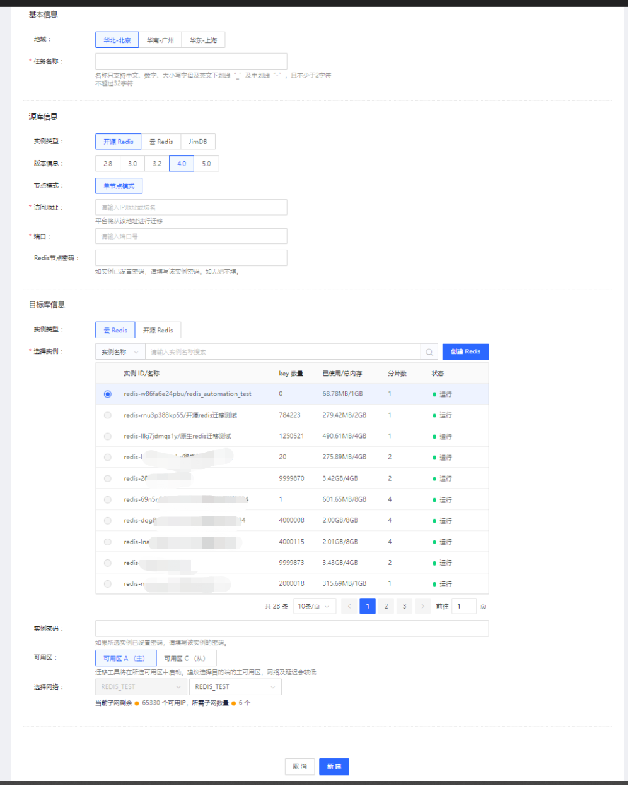
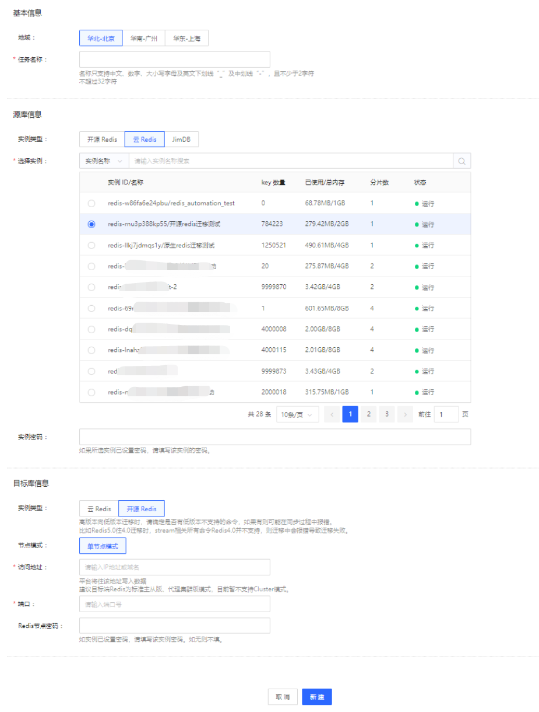

# 从自建Redis迁移到云Redis

##  standalone版本迁移上云

当前RDTS工具可支持standalone版本迁移到云上Redis4.0主从版。迁移过程中，可以为每一个需要迁移的源端实例，建立两个迁移任务，分别用于：上云迁移任务、回滚迁移任务。

上云迁移任务中，源端配置为开源redis、目标端配置为云上redis。

回滚迁移任务中，源端配置为云上redis、目标端配置为开源Redis。

## cluster 版本迁移上云

当前RDTS工具还未完全支持该版本迁移。

- 对于上云迁移流程，可使用 redis-migrate-tool工具，操作见： [使用开源工具迁移介绍](MigrationDoc-3.md) 

- 对于回滚迁移任务，可以在目标Cluster集群部署一个代理（predixy)， 然后使用RDTS，在目标端配置开源Redis并填入代理地址，用该方式进行回滚迁移任务。通过rdts，可以监控整个迁移链路的异常。

注：predixy目前需要手动在云主机上部署，并配置一个lb。如果predixy代理有异常，RDTS的链路监控能够及时发现
