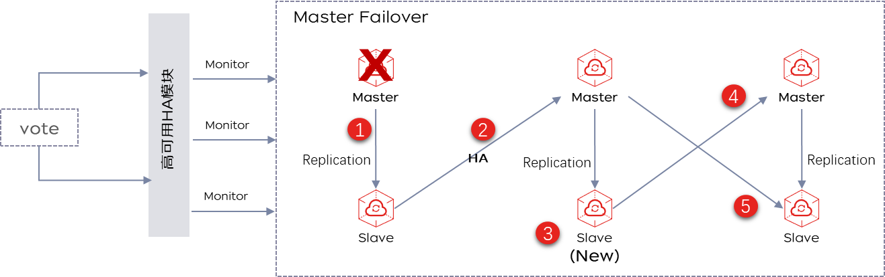
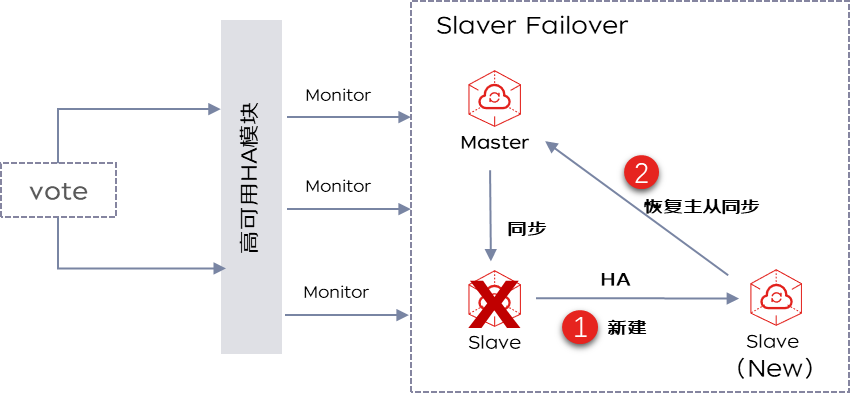

# 容灾恢复

京东云缓存Redis通过主从架构、多可用区部署、双机热备、自动切换，来实现高可用。工作时主节点和从节点数据实时同步，主节点故障时系统自动进行秒级切换，从节点接管业务（期间会有秒级的闪断，重连即恢复）。完全恢复后，主从所在的AZ会跟创建时保持一致。

## 主节点恢复原理

**故障场景：** Redis进程crash；Redis节点失联（网络故障）。

**故障恢复原理：** 云缓存Redis通过 高可用HA模块 侦测节点故障。当主节点发生故障时，会自动进行主从切换，将Slave提升为Master。同时会新建1个Slave节点，当复制数据完成后，新从节点会提升为新的主节点，而这时的主节点会回到Slave角色。通过该原理来保证主节点宕机下的高可用。如果实例架构为Proxy集群版，代理会自动监测故障，并做流量切换。此外，您可以在报警监控中配置实例故障监控，见：   [节点异常监控](https://docs.jdcloud.com/cn/jcs-for-redis/node-notice)

**故障恢复时长说明：** 平台可在5-30秒左右检测到故障并开始做主从切换、恢复数据面可用、故障节点的恢复处理等工作。

## 从节点恢复原理

**故障恢复原理：**  当高可用HA模块侦测到从节点故障时，会自动新建1个Slave节点，连接主节点进行数据复制。从而保证从节点宕机下的高可用。

## 多可用区高可用

Redis所有规格均支持主从多可用区部署。某个可用区出现故障时，提供跨可用区的高可用机制，使云数据库Redis版比自建Redis更稳定。

实例默认开启数据持久化功能，支持数据自动备份，您可以使用备份文件恢复实例，有效地解决误操作问题并实现可靠的灾备。
