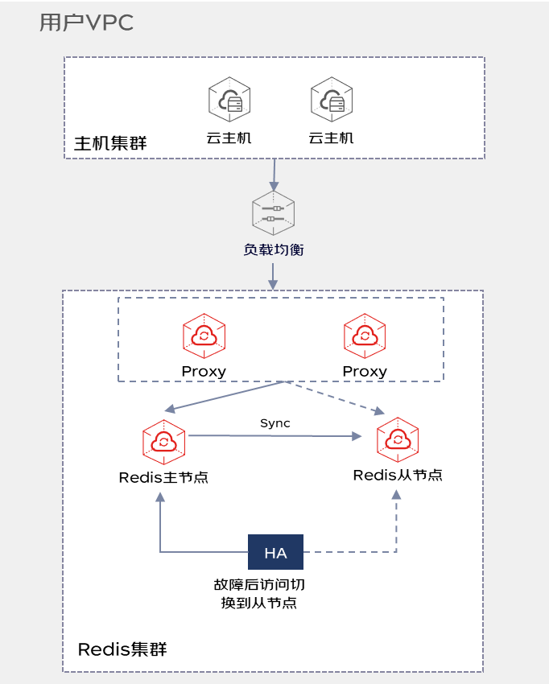
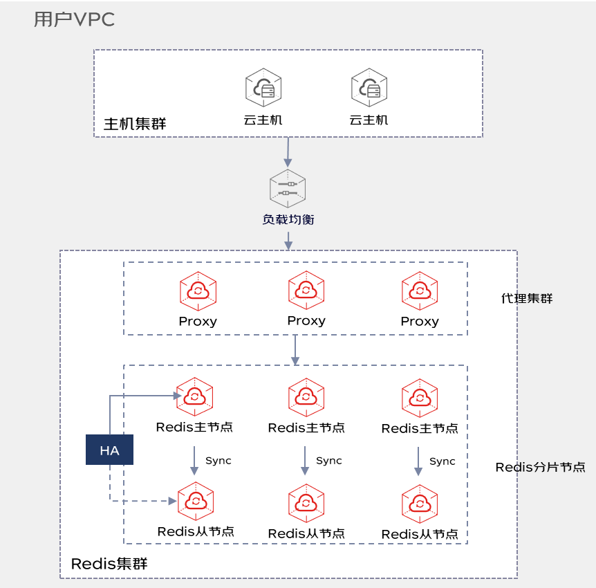
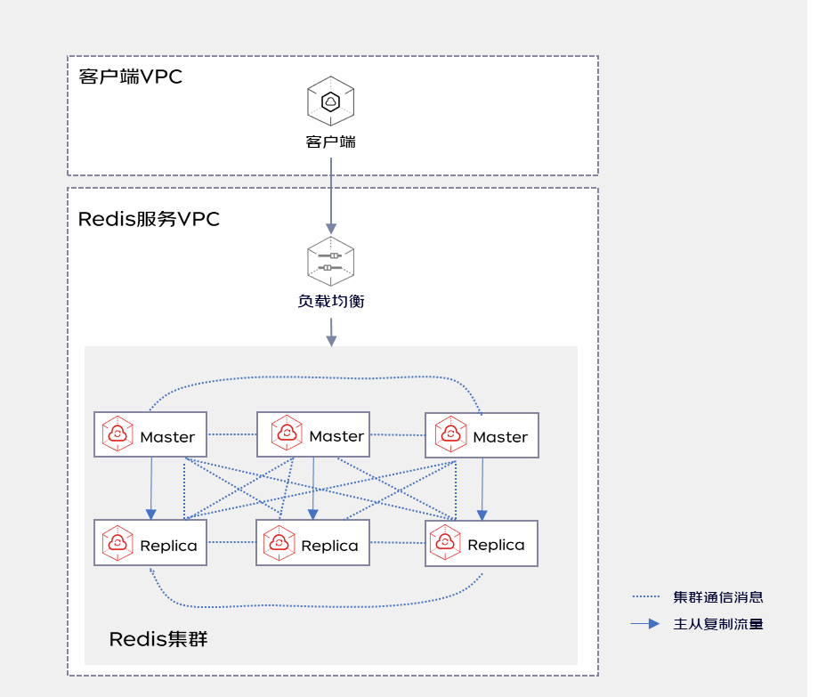

# 实例架构

云缓存Redis目前支持三种架构类型：标准版、Proxy集群版、Cluster集群版，均为默认双副本架构。

## 标准版
标准版实例，适用于对Redis协议兼容性要求较高，性能压力可控的业务场景。

| 标准版      |  基本信息  | 
|    :---     | :---  |	
|    兼容版本  | Redis 2.8、Redis 4.0  |	
|   副本数     | 共2副本，包含1主节点、1从节点，数据通过实时复制保持一致。  |	
|   实例规格    | 实例规格可支持1G-32G ；支持多DB，用户可自定义0-255个   |	
|   可用性      | 通过HA高可用机制，当主节点故障后，系统将会自动在30秒内进行主从切换，将从节点升级为主节点。   |	
|   可靠性      | 支持从副本持久化；支持手动/自动定期进行RDB快照；支持通过从备份文件恢复。 |	
|   变配        | 支持容量扩缩容。如需更大规格或者更高QPS，可支持变配为Proxy集群版架构。   |	
|上云迁移支持度  | 支持从 Standalone模式的 开源Redis 迁移到云上Redis。支持迁移的版本包含：2.8\3.0\3.2\4.0\5.0。 |	
|   客户端协议  | 传统Redis客户端即可。  |	

##  Proxy集群版

Proxy集群版实例，适用于数据容量较大、QPS要求较高的业务场景。该架构类型实例默认提供Proxy代理，当客户端请求时将由代理节点转发至Redis数据节点，通过代理实现负载均衡、长连接等功能特性，具体可参考： [ Redis Proxy特性说明](https://docs.jdcloud.com/cn/jcs-for-redis/proxy-info)

| Proxy集群版  |  基本信息  | 
|    :---      | :---  |	
|    兼容版本  | Redis 2.8、Redis 4.0  |	
|   副本数     | 共2副本，包含1主节点、1从节点，数据通过实时复制保持一致。 |	
|   实例规格    | 实例规格可支持4G-4T；分片选择可支持用户自定义2-128分片；支持多DB，用户可自定义0-255个   |	
|   可用性      | 通过HA高可用机制，当主节点故障后，系统将会自动在30秒内进行主从切换，将从节点升级为主节点。   |	
|   可靠性      | 支持从副本持久化；支持手动/自动定期进行RDB快照；支持通过从备份文件恢复。 |	
|  读写分离     | 不支持读写分离  |	
|   变配        | 支持容量扩缩容和分片扩缩容。   |	
|  上云迁移支持度  | 支持从 Standalone模式的 开源Redis 迁移到云上Redis。支持迁移的版本包含：2.8\3.0\3.2\4.0\5.0。 |	
|   客户端协议  | 传统Redis客户端即可。  |	

##  Cluster集群版

Cluster集群版实例，适用于QPS要求较高的业务场景。Cluster是一个无中心的分布式架构，高可用切换机制已内置进集群，其QPS性能优于Proxy集群版实例。但是Cluster集群版存在一些局限性，如：

- 不支持处理多个key的请求，除非多key在同一slot。

- failover时可能会丢失新写入的数据

- reshard时，多key操作在一段时间内不可用

- 只有db 0, 不支持多和数据库，不允许使用select命令

- 每个节点之间都会建立TCP长连接

| Cluster集群版  |  基本信息  | 
|    :---      | :---  |	
|    兼容版本  | Redis 5.0  |	
|   副本数     | 共2副本，包含1主节点、1从节点，数据通过实时复制保持一致。 |	
|   实例规格    | 实例规格可支持3G-2T；分片选择可支持用户自定义2-128分片；不支持多DB。   |	
|   可用性      | 通过HA高可用机制，当主节点故障后，系统将会自动在30秒内进行主从切换，将从节点升级为主节点。   |	
|   可靠性      | 支持从副本持久化；支持手动/自动定期进行RDB快照；支持通过从备份文件恢复。 |	
|  读写分离     | 支持从客户端实现读写分离  |	
|   变配        | 支持容量扩缩容和分片扩缩容。   |	
|   客户端协议  | 需要支持Redis Cluster协议   |	

