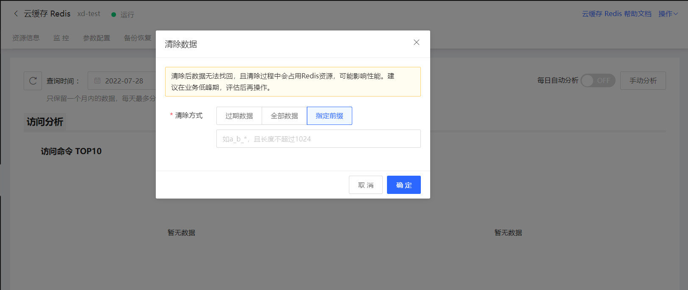

# 清除数据

您可以在控制台清除Redis实例中的数据，目前支持清除方式包含：过期数据、全部数据、指定前缀数据。

注意：

- 由于该命令属于风险操作，实例数据将被全部清理，且清空之后无法恢复，因此请谨慎操作。 

- 在参数设置中禁用 FLUSHALL命令不会影响控制台中清除数据功能。

- 数据清除过程中不会影响实例对外提供的服务。

- 清除过程中不能同时执行变配、修改参数等操作。

## 操作入口
进入实例详情页，点击右上角【操作】下拉菜单，找到数据清除操作。

## 操作流程

1.选择需要进行操作的实例，进入实例详情页

2.单击右上角【操作】下拉菜单的清除数据操作。

3.在弹出的对话框中，选择待清除方式，并点击确定进行清除。

