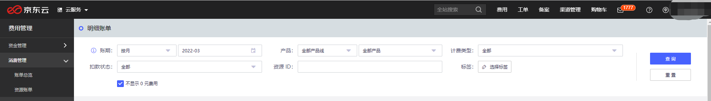

# 购买流程

## 使用限制
为保证实例能顺利创建，购买实例前请仔细查阅实例使用限制，详细请参考：[使用限制](../Introduction/Restrictions.md)  。

##  前提条件
### 账户准备

1、若您还未注册京东智联云账号，可在京东智联云官网进行注册，请参考 [注册京东智联云](https://user.jdcloud.com/register) 。

2、需要实名认证。您可选择对账号进行个人实名认证或企业实名认证，详见  [实名认证](https://docs.jdcloud.com/cn/real-name-verification/introduction
) 。

### 支付准备
1、如您购买按配置计费实例，由于采用后付费模式，为避免计费周期内账户余额不足导致影响实例正常使用，需要您的账户余额及可用代金券之和不低于消费门槛。

2、如您购买包年包月实例，由于采用预付费模式，您需要一次性支付所选实例配置在指定生命周期内的全部费用，因此需要账户余额（现金余额+可用代金券金额）充足或在付款时选择第三方支付完成付款。

3、需确保账户余额（或代金券金额）不少于 50 元。

##  操作步骤

### 购买Redis实例流程

1.用户使用用户名密码登录 京东云控制台；

2.选择数据库与缓存大类下的缓存Redis产品，进入Redis控制台界面；

3.点击“新建”按钮，跳转到Redis产品订购页；

4.选择付费方式、地域、规格、网络、部署方案、基本信息、购买量等，核实无误后点击“确定购买”；

5.跳转到订单确认付费界面，勾选同意《缓存Redis服务条款》，点击“去支付”；

6.付费完成后，在控制台等待1-3分钟，实例变为运行状态，购买实例完毕，可正常使用。

###  包年包月与按配置支付类型转换

如果您的资源为包年包月付费类型资源，将不能转换为按配置付费。如需删除，可提交工单。

如果您的资源为按配置付费类型资源，可通过控制台转换为包年包月资源。操作流程如下：

1.找到要续费的实例，点击“操作”中的“续费”操作。

2.即跳转至对应续费页面，确认实例信息和购买信息，提交付款。

### 查看消费明细
1.登录 控制台。

2.选择页面右上角费用的订单管理。

3.在左侧导航栏中选择消费管理列表下的明细账单。

4.根据您的需求筛选项，即可查看消费明细。

