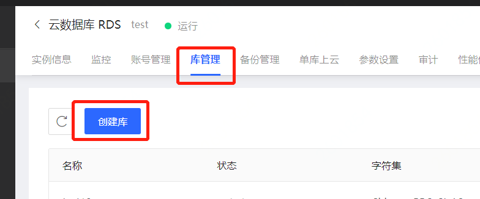
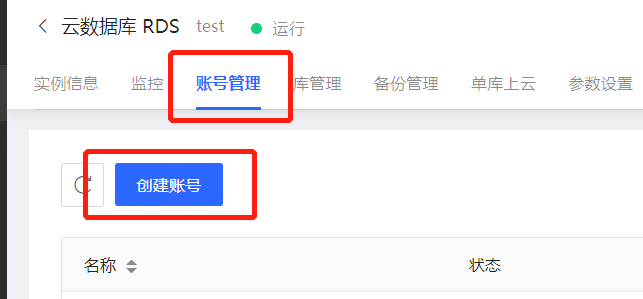

# 创建数据库和账号
本文主要以mysql为例讲述如何创建数据库和账号
## 创建数据库
1. 访问[RDS实例列表](https://rds-console.jdcloud.com/rds/database)，选择实例所在地域。
2. 点击目标实例，进入实例详情页
3. 点击 **库管理**，切换到账号管理tab
4. 点击**创建库**按钮
    
5. 进行库设置
   |参数名称|说明|
   |--|--|
   |数据库名称|&bull;2-32位字符  &bull;支持小写字母、数字以及英文划线及下划线  &bull;数据库名称在实例中唯一  &bull;不可使用保留字，参见 [限制说明](https://docs.jdcloud.com/cn/rds/mysql-restrictions)|
   |字符集|可选择utf8, gbk, latin1, utf8mb4, euckr, armscii8, ascii, big5。|
6. 点击**确定**，完成库创建
   
## 创建账号
1. 访问[RDS实例列表](https://rds-console.jdcloud.com/rds/database)，选择实例所在地域。
2. 点击目标实例，进入实例详情页
3. 点击 **账号管理**，切换到账号管理tab
4. 点击**创建账号**按钮
   

5. 进行账号设置
   |参数名称|说明|
   |--|--|
   |数据库名称|限制条件：支持数字、大小写字母以及英文下划线"_",不超过32个字符|
   |字符集|限制条件：必须包含大小写字母以及数字，不支持'\'、 '/'、 '"'、 '@'、英文单引号和中文这六类字符，长度应不少于 8 字符且不超过 32 字符|

6. 点击**确定**，完成账号创建

## 相关文档

API：[创建数据库](https://docs.jdcloud.com/cn/rds/api/createdatabase?content=API)
API：[创建账号](https://docs.jdcloud.com/cn/rds/api/createaccount?content=API)