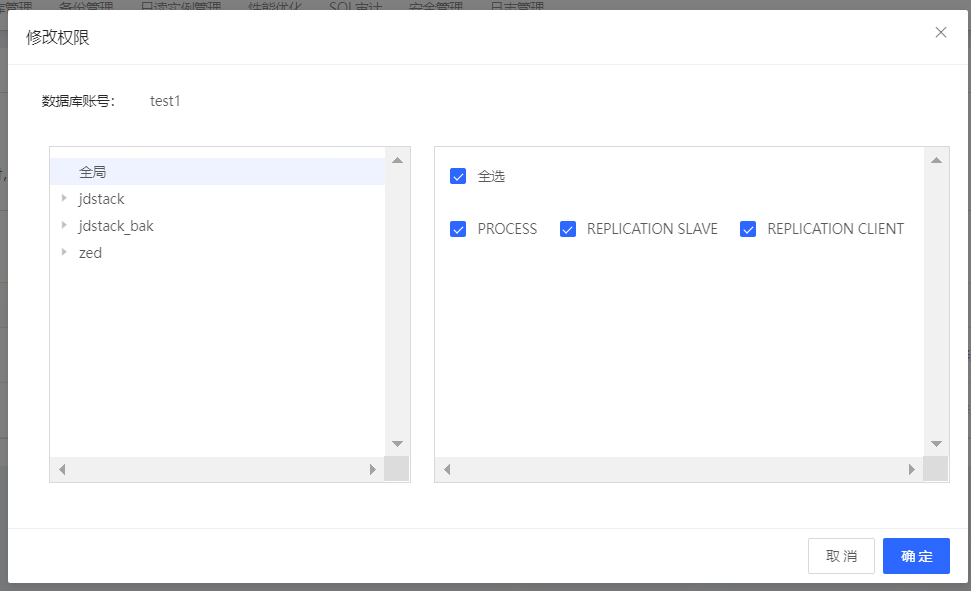

# MySQL 创建账号
在使用数据库之前，您需要在云数据库 MySQL 实例中创建账号。目前您无法通过 SQL 语句来管理数据库账号，只能通过控制台操作。

## 操作步骤 
1. 登录 [云数据库 RDS 控制台](https://rds-console.jdcloud.com/rds/database)。
2. 点击目标实例，进入实例详情页。
3. 点击 **账号管理** 标签进入账号管理页面，点击 **创建账号** 按钮，创建账号弹出框参数说明如下：

   * 账号名：1-32位，账号只支持数字、大小写字母及英文下划线“_”，不超过32字符
   * 密码：8-32位，必须包含大小写字母及数字，不支持'\'、 '/'、 '"'、 '@'、英文单引号和中文这六类字符。
   
   >注： 数据库账号，密码：数据库账号我们保留了一些关键字名称，请参考 [限制说明](../../../Introduction/Restrictions/MySQL-Restrictions.md)。

4. 账号创建成功后，可在账号管理页面对账号进行管理。

## 授权数据库
1. 选中需要修改权限授权权限的库，可以选择对全局授权、针对库授权、针对表授权的不同粒度
2. 转移到右侧进行授权，点击**全部**则勾选了可授予的全部权限。

 

4. 单击 **确定** 按钮，完成账号授权操作。

## 相关API
创建账号：[createAccount](https://docs.jdcloud.com/cn/rds/api/createaccount)
授权账号：[grantAccountPrivilege](https://docs.jdcloud.com/cn/rds/api/grantaccountprivilege)
查看账号：[describeAccounts](https://docs.jdcloud.com/cn/rds/api/describeaccounts)
