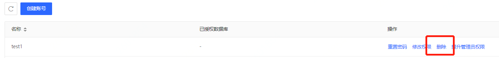

# 删除账号
当您需要将数据库账号进行停用时，可以通过控制台进行账号删除。

## 注意事项
* 高权限账号创建后不允许被删除。
* 数据库账号删除后不可恢复，请确认即将删除的账号不再被任何应用提供使用后再进行删除。

## 操作步骤
1. 登录 [云数据库 RDS 控制台](https://rds-console.jdcloud.com/rds/database)。
2. 点击目标实例，进入实例详情页面，选择 **账号管理** 页面，点击 **删除**按钮，弹出删除弹窗。  

3. 点击 **确认** 完成删除。
