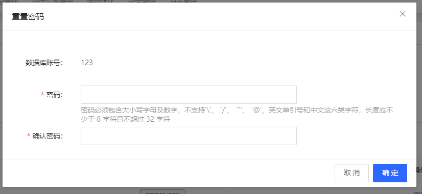

# 重置密码
在使用 RDS 过程中，如果忘记数据库账号密码或者需要修改密码，可以通过云数据库 RDS 管理控制台重新设置密码。 

## 注意事项
* 为了数据安全，建议定期更换密码。

## 操作步骤
1. 登录 [云数据库 RDS 管理控制台](https://rds-console.jdcloud.com/rds/database) 。
2. 选择需要重置账号密码的目标实例，点击目标实例，进入实例详情页。
3. 点击 **账号管理** 按钮，切换至账号管理tab。
4. 选择需要重置密码的账号，点击 **重置密码** ，进入修改密码弹窗。弹框参数说明如下:
   * 密码：8-32位，必须包含大小写字母及数字，不支持'\'、 '/'、 '"'、 '@'、英文单引号和中文这六类字符。

  

4. 点击 **确定** 按钮，完成密码修改。
