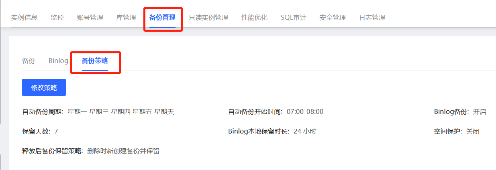
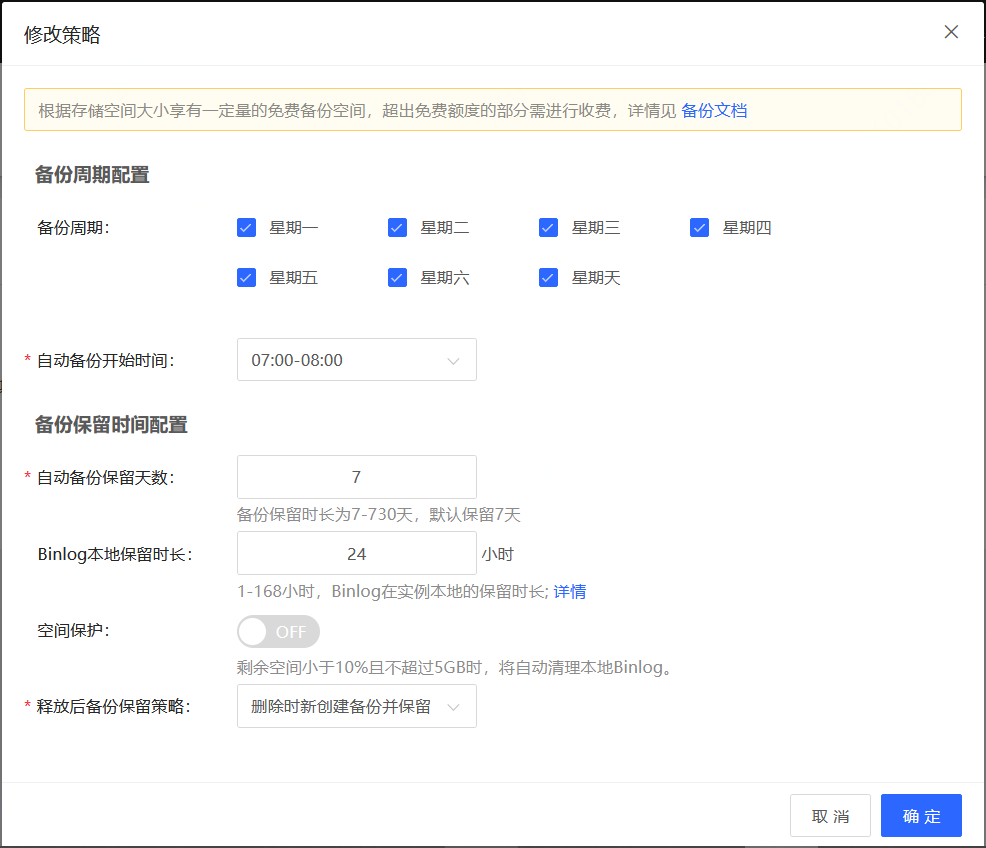

# 备份策略
云数据库 MariaDB 实例支持自动备份和手动备份，可根据实际需求进行备份策略设置。

## 注意事项
* 请确保在业务低峰期进行自动备份。

## 修改备份策略
1. 登录 [云数据库 RDS 控制台](https://rds-console.jdcloud.com/database)。
2. 选择需要进行设置自动备份策略的目标实例，点击目标实例的名称，进入到实例详情页。
3. 选择 **备份管理** 标签，点击 **备份策略** 标签进入实例备份策略的详情页.
   
   
4. 点击 **修改策略** 按钮，修改备份策略弹出框参数说明如下： 

    |参数|说明|
    |--|--|
    |备份周期|默认为每天一次自动备份，每周至少选择一天进行自动备份|
    |自动备份开始时间|选择数据备份的开始时间段，系统会自动在这个时间段的任意时间点执行备份操作。|
    |自动备份保留天数|&bull; 默认保留7天 &bull; 可设置范围：7-730天|
    |Binlog本地保留时长|&bull; 可设置时间范围：1-168小时，默认保留时长为24小时 &bull; 超过设置的本地binlog保留时长后binlog会被自动清理|
    |空间保护|&bull; 选择开启或关闭实例空间保护 &bull; 剩余空间小于10%且其余5GB时，将自动从历史最远Binlog逐步删除binlog到可用空间高于系统阈值|
    |释放后备份保留策略|默认为删除后新建备份并保留，用户可根据实际需求进行设置保留方式，详情请查看[长期保留备份](https://docs.jdcloud.com/cn/rds/enduring-backup-retention)|
    
4. 点击 **确定** 按钮，完成备份策略的修改。

    
    
## 相关API
查看实例备份策略：[describeBackupPolicy](https://docs.jdcloud.com/cn/rds/api/describebackuppolicy)  