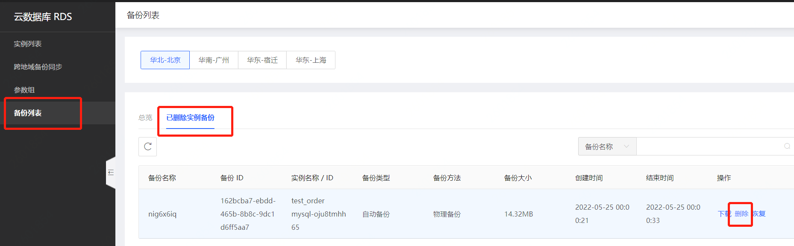

# 删除备份
由于单个实例支持的手动备份数是有限制的，所以当您需要新建新的手动备份，但是当前已无可用配额的时候，可以选择删除老的手动备份。

## 注意事项
* 仅手动备份允许删除，自动备份不允许删除
* 数据备份和日志备份存放在备份空间内，不占用系统存储空间

## 手动删除备份
1. 登录[云数据库 RDS管理控制台](https://rds-console.jdcloud.com/database)。
2. 选择目标实例所在地域。
3. 点击目标实例，进入实例详情页，切换至 **备份管理** Tab 页，找到要删除的数据库，操作 **删除**。
4. 在确认弹窗中，点击 **确定** 删除备份。

## 自动删除备份
1. 登录[云数据库 RDS管理控制台](https://rds-console.jdcloud.com/database)。
2. 选择目标实例所在地域。
3. 点击目标实例，进入实例详情页，切换至 **备份管理** Tab 页。
4. 进入 **备份策略** Tab页，点击 **修改策略**，进入弹窗。
5. 修改 **备份保留时长**，点击 **确定** 完成备份保留时长的修改。

## 已删除实例备份的删除
1. 登录[云数据库 RDS管理控制台](https://rds-console.jdcloud.com/database)。
2. 右侧菜单栏，切换到 **备份列表** 。选择 **已删除实例备份** Tab页面。
3. 选择不再需要保留的实例，右侧操作列点击删除。

## 相关API
手动删除备份：[deleteBackup](https://docs.jdcloud.com/cn/rds/api/deletebackup)
修改备份策略：[modifyBackupPolicy](https://docs.jdcloud.com/cn/rds/api/modifybackuppolicy)