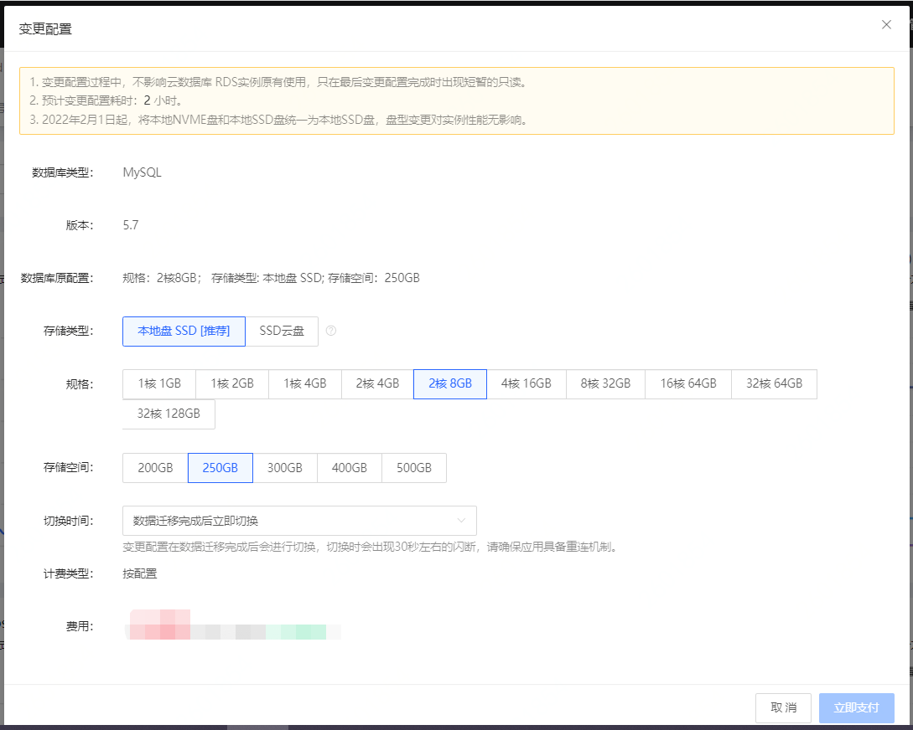

# 调整配置

用户可根据实际需求动态调整实例的CPU，内存及磁盘大小。 配置调整过程中，RDS 实例可正常使用，调整完成后，会有一个短暂的闪断，需保证应用应用服务有数据库重连机制。

## 注意事项
* RDS实例均支持CPU扩缩容
* MySQL、Percona、MariaDB、PostgreSQL支持磁盘扩缩容。
* SQL Server仅支持磁盘扩容不支持磁盘缩容
* 为保证系统稳定性，建议扩缩容磁盘空间大于已使用磁盘空间，以避免在缩容后实例只读

## 影响
* 实例变配期间会产生闪断，请在业务低估期间进行操作
* 实例变配期间不可做其他操作，请在变配完成后再进行其他操作
  
## 操作步骤
1. 登录[云数据库RDS控制台](https://rds-console.jdcloud.com/rds/database)
2. 选择目标实例，右侧操作列点击 **更多-变更配置/调整配置**
    * 列表页：选择需要目标实例，点击 **操作** 这一列的 **更多 -> 变更配置/调整配置**
    * 实例详情页：进入到 **实例详情页** ，点击页面右上角的 **操作 -> 变更配置/调整配置**
2. 选择调整后的存储类型及配置
3. 选择需要进行切换的时间，可根据业务需求立即切换、可维护时间内切换或迁移完成后延迟切换。
   >注：SQL Server、PostgreSQL不支持选择切换时间  

4. 点击 **立即支付** 执行调整配置。
    
   

## 相关问题 

1. 升级主实例配置时，只读实例的配置是否会自动升级？
只读实例不会自动升级，需要您手动升级。  

2. 变更配置后，实例的访问地址会发生变化吗？
实例变更配置后，实例的内外网域名不会发生变化。

## 相关API
调整配置：[modifyInstanceSpec](https://docs.jdcloud.com/cn/rds/api/modifyinstancespec)