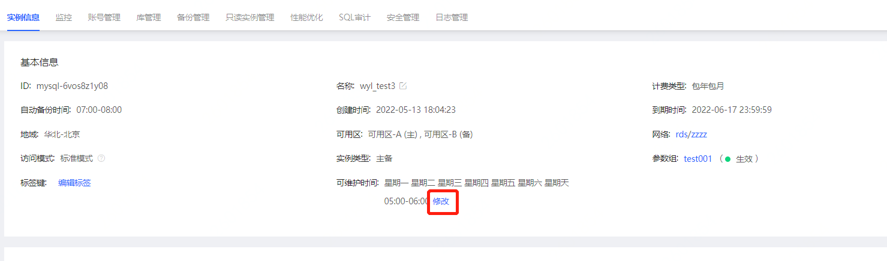
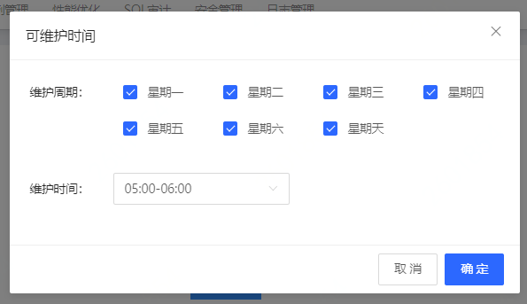

# 修改可维护时间

为了保障云数据库RDS实例的稳定性，京东云平台会不定期对数据库实例进行维护操作。默认可维护时间段为凌晨05：00-06：00，可根据业务实际情况进行可维护时间的调整，将可维护时间调整至业务低估时间，从而避免维护过程中对业务造成影响。

## 注意事项
* 仅MySQL、Percona、MariaDB支持修改可维护时间

<!--## 注意事项

* 在进行维护前，京东云会对用户账户中所设置的联系人发送短信，请注意查收
* 实例维护时，为保证整个维护过程的稳定性，实例会在可维护时间段内变更状态为**维护中**状态。当实例处于该状态时，不影响进行查询类操作（如查询监控），但不可进行实例操作，包括但不限于账号管理、库管理、白名单设置、升降配、删除、重启等操作
* 在可维护时间内，可能出现闪断或实例重启等影响，需确保应用程序有重连机制。-->

## 操作步骤

1. 登录 [云数据库 RDS 控制台](https://rds-console.jdcloud.com/database) 。
2. 选择需要进行设置手动备份的目标实例，点击目标实例的名称，进入到实例详情页。
3. 基本信息部分中找到**可维护时间**列,点击**修改按钮**，进入可维护时间修改弹窗。

4. 对维护周期和维护时间进行设置，点击**确定**，完成可维护时间设置。

