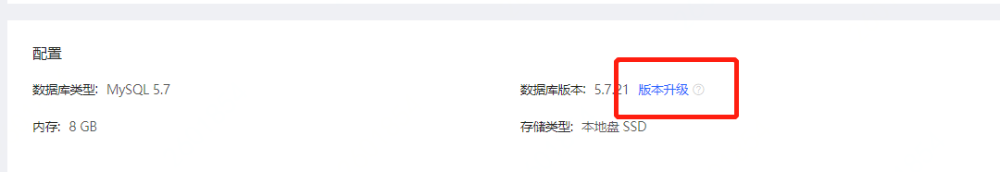
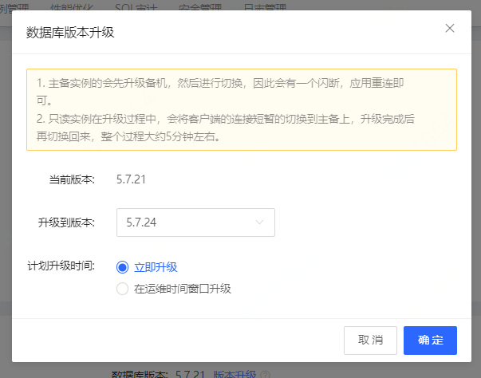

#小版本升级

云数据库RDS支持手动升级内核小版本，内核小版本的升级涉及性能提升、新功能或问题修复等。

## 注意

* 小版本升级后无法降级
* 当实例进行升级或变配时，将会自动升级到最新的内核小版本。
* 升级小版本会重启实例，重启的具体时间取决于您设置的升级时间（立即升级或可维护时间段升级）RDS服务可能会出现秒级服务中断，请选择业务低估时间进行升级，并确保应用有自动重连机制

## 操作步骤

1. 登录 [云数据库 RDS 控制台](https://rds-console.jdcloud.com/database) 。
2. 点击目标实例的名称，进入到实例详情页。
3. 配置部分中找到**数据库版本**列，点击**版本升级**进入版本升级弹窗。
  

4. 选择需要升级的版本及计划升级时间，点击**确定**，完成数据库版本升级。
  

## 相关问题
1. 小版本升级需要一个版本一个版本的升级吗？
不需要，小版本升级支持指定版本进行升级，无需每个版本逐一升级。