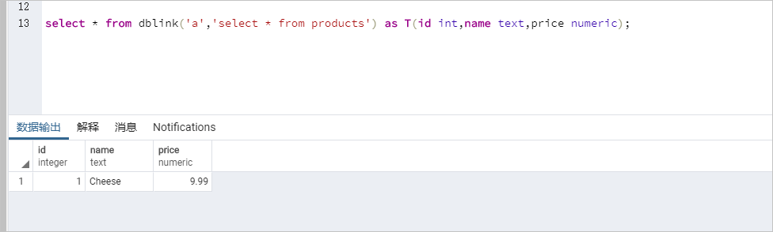
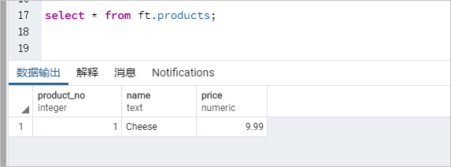

# 跨库操作（dblink、postgres_fdw）

## 使用说明
京东云RDS-PostgreSQL支持dblink和postgres_fdw插件，支持相同VPC内实例（包括自建PostgreSQL数据库）间的跨库操作。

## 注意事项
* 相同VPC内的云主机/RDS  PostgreSQL实例可以直接跨库操作。
* 自建PostgreSQL实例可以通过oracle_fdw或mysql_fdw连接VPC外部的Oracle实例或MySQL实例。
* 连接自身跨库操作时，host请填写localhost，port请填写`show port`命令返回的本地端口。
* 需要将RDS PostgreSQL的专有网络网段（例如`172.xx.xx.xx/16`）添加到目标数据库的白名单中，允许RDS PostgreSQL访问，详情参见[设置白名单](https://docs.jdcloud.com/cn/rds/set-whitelist)。

## 使用dblink

1. 新建dblink插件。

   ```
   create extension dblink;
   ```

2. 创建dblink连接。

   ```
   postgres=> select dblink_connect('<连接名称>', 'host=<同一VPC下的另一RDS的内网域名> port=<同一VPC下的另一RDS的内网监听端口> user=<远程数据库用户名> password=<密码> dbname=<库名>');
   
   postgres=> SELECT * FROM dblink('<连接名称>', '<SQL命令>') as <表名>(<列名> <列类型>); 
   ```

   示例

```
postgres=> select dblink_connect('a', 'host=pgm-bpxxxxx.pg.rds.aliyuncs.com port=3433 user=testuser2 password=passwd1234 dbname=postgres'); 


postgres=> select * from dblink('a','select * from products') as T(id int,name text,price numeric);  //查询远端表                     
```



更多详情请参见[dblink](https://www.postgresql.org/docs/12/dblink.html)。

## 使用postgres_fdw

1.新建一个数据库。

```
postgres=> create database <数据库名>;  //创建数据库

postgres=> \c <数据库名>  //切换数据库
```

示例

```
postgres=> create database db1;  
CREATE DATABASE  

postgres=> \c db1  
```

2. 新建postgres_fdw插件。

```
db1=> create extension postgres_fdw;
```

3. 新建远程数据库服务器。

```
db1=> CREATE SERVER <server名称>                                                              
        FOREIGN DATA WRAPPER postgres_fdw  
        OPTIONS (host '<同一VPC下的另一RDS的内网域名>,port '<同一VPC下的另一RDS的内网监听端口>', dbname '<同一VPC下的另一RDS的库名>');  

db1=> CREATE USER MAPPING FOR <本地数据库用户名>      
        SERVER <server名称> 
        OPTIONS (user '<远程数据库用户名>', password '<远程数据库密码>');  
```

示例

```
db1=> CREATE SERVER foreign_server1                                                              
        FOREIGN DATA WRAPPER postgres_fdw  
        OPTIONS (host 'pgm-bpxxxxx.pg.rds.aliyuncs.com', port '3433', dbname 'postgres');  
CREATE SERVER  

db1=> CREATE USER MAPPING FOR testuser      
        SERVER foreign_server1  
        OPTIONS (user 'testuser2', password 'passwd1234');  
CREATE USER MAPPING  
```

4. 导入外部表。

```
db1=> import foreign schema public from server foreign_server1 into <SCHEMA名称>;  //导入外部表

db1=> select * from <SCHEMA名称>.<表名>      //查询远端表
```

示例

```
db1=> import foreign schema public from server foreign_server1 into ft;  
IMPORT FOREIGN SCHEMA  

db1=> select * from ft.products;  
```



更多详情请参见[postgres_fdw](https://www.postgresql.org/docs/12/postgres-fdw.html)。

