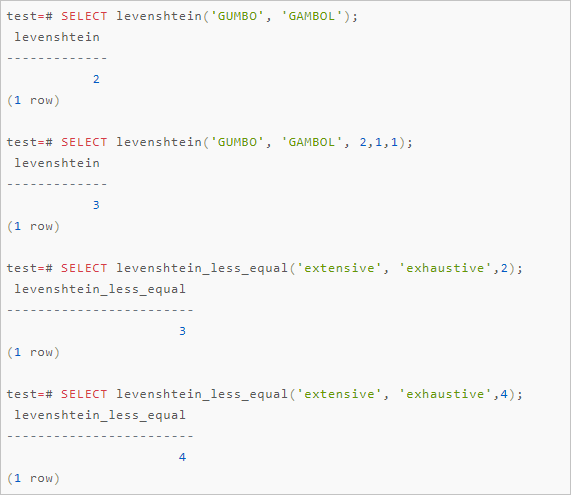

# 字符串相似性判断（fuzzystrmatch）

## 使用说明

京东云RDS PostgreSQL支持fuzzystrmatch插件，提供Soundex、Levenshtein、Metaphone和Double Metaphone四种功能，能够用来判断字符串之间的相似性和距离。


## Soundex

Soundex功能可以将相似发音的名字转换成相同的代码并进行匹配，但是Soundex对于非英语名称效果较差。

Soundex功能提供如下函数：

```
soundex(text) returns text
difference(text, text) returns int
```

- soundex函数将一个字符串转换成它的Soundex代码（例如A550）。

- difference函数将两个字符串转换成它们的Soundex代码并报告两个代码匹配位置的数量。由于Soundex代码具有四个字符，代码匹配位置数量的取值范围是0~4，0表示没有匹配，4表示完全匹配。

  用法示例如下：

```
SELECT soundex('hello world!');
SELECT soundex('Anne'), soundex('Andrew'), difference('Anne', 'Andrew');
SELECT soundex('Anne'), soundex('Margaret'), difference('Anne', 'Margaret');

CREATE TABLE s (nm text);
INSERT INTO s VALUES ('john');
INSERT INTO s VALUES ('joan');
INSERT INTO s VALUES ('wobbly');
INSERT INTO s VALUES ('jack');

SELECT * FROM s WHERE soundex(nm) = soundex('john');
SELECT * FROM s WHERE difference(s.nm, 'john') > 2;
```

## Levenshtein

Levenshtein功能可以计算两个字符串之间的编辑距离（Levenshtein距离）。

Levenshtein功能提供如下函数：

```
levenshtein(text source, text target, int ins_cost, int del_cost, int sub_cost) returns int
levenshtein(text source, text target) returns int
levenshtein_less_equal(text source, text target, int ins_cost, int del_cost, int sub_cost, int max_d) returns int
levenshtein_less_equal(text source, text target, int max_d) returns int
```

参数说明如下。

| **参数**     | **说明**                                           |
| ------------ | -------------------------------------------------- |
| **source**   | 第一个字符串，任意非空字符串， 最长支持255个字符。 |
| **target**   | 第二个字符串，任意非空字符串， 最长支持255个字符。 |
| **ins_cost** | 字符插入的开销。                                   |
| **del_cost** | 字符删除的开销。                                   |
| **sub_cost** | 字符替换的开销。                                   |
| **max_d**    | 最大Levenshtein距离。                              |


**说明** levenshtein_less_equal函数是Levenshtein函数的加速版本，在只计算小距离时使用：

- 如果实际的距离低于或等于max_d，levenshtein_less_equal返回精确值。
- 如果实际的距离大于max_d，levenshtein_less_equal返回大于max_d的值。
- 如果max_d为负值，levenshtein_less_equal函数和levenshtein函数相同。

用法示例如下：

```
SELECT levenshtein('GUMBO', 'GAMBOL');
SELECT levenshtein('GUMBO', 'GAMBOL', 2,1,1);
SELECT levenshtein_less_equal('extensive', 'exhaustive',2);
SELECT levenshtein_less_equal('extensive', 'exhaustive',4);
```




## Metaphone

Metaphone功能的思想和Soundex功能相同，构建一个输入字符串的表示代码，如果两个字符串具有相同的代码则认为它们相似。

Metaphone功能提供如下函数：

```
metaphone(text source, int max_output_length) returns text
```

参数说明如下。

| **参数**              | **说明**                                                     |
| --------------------- | ------------------------------------------------------------ |
| **source**            | 任意非空字符串， 最长支持255个字符。                         |
| **max_output_length** | 设置输出的metaphone代码的最大长度，如果超长，输出会被截断到这个长度。 |

用法示例如下：

```
SELECT metaphone('GUMBO', 4);
```

## Double Metaphone


Double Metaphone功能能够为一个输入的字符串计算出两个相似的字符串，包括一个主要函数和一个次要函数。在大部分情况下它们是相同的，但是对于非英语名称它们可能有一点不同（取决于发音）。

Double Metaphone功能提供的主要和次要函数如下：

```
dmetaphone(text source) returns text
dmetaphone_alt(text source) returns text
```

用法示例如下：

```
select dmetaphone('gumbo');
select dmetaphone_alt('gumbo');
```

