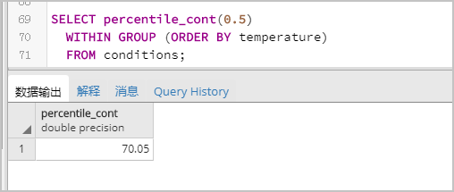
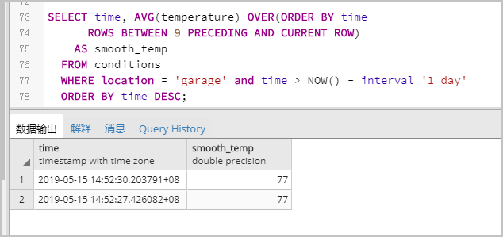

# 时序数据库（TimescaleDB）
## 使用说明
京东云RDS-PostgreSQL支持TimescaleDB插件版本，支持时序数据的自动分片、高效写入、检索、准实时聚合等。

目前RDS PostgreSQL对外开放的是Open Source版本的TimescaleDB，由于License等问题，可能暂不支持一些高级特性，详情参见[TimescaleDB](https://www.timescale.com/products)。
## 前提条件
* 京东云PostgreSQL实例版本支持  11、12、13。

* 使用该插件前，需要将timescaledb加入到 **shared_preload_libraries**  参数中。

  您可以使用RDS-PostgreSQL参数设置功能，为**shared_preload_libraries**参数添加**timescaledb**。具体操作，请参见[修改参数](https://www.postgresql.org/docs/10/runtime-config.html)。

## 添加TimescaleDB插件

使用pgAdmin客户端连接实例，添加TimescaleDB，命令如下：

```
CREATE EXTENSION IF NOT EXISTS timescaledb CASCADE;
```


## 创建时序表

1. 创建标准表conditions，示例如下

```
CREATE TABLE conditions (
  time        TIMESTAMPTZ       NOT NULL,
  location    TEXT              NOT NULL,
  temperature DOUBLE PRECISION  NULL,
  humidity    DOUBLE PRECISION  NULL
);
```

2. 创建时序表，示例如下：

```
SELECT create_hypertable('conditions', 'time');
```

**说明** 详细命令说明请参见[Create a Hypertable](https://docs.timescale.com/timescaledb/latest/how-to-guides/hypertables/create/?spm=a2c4g.11186623.0.0.6527782crrsAJw)。

### 高效写入

您可以使用标准SQL命令将数据插入超表（Hypertables），示例如下：

```
INSERT INTO conditions(time, location, temperature, humidity)
  VALUES (NOW(), 'office', 70.0, 50.0);
```

您还可以一次将多行数据插入到超表中，示例如下：

```
INSERT INTO conditions
  VALUES
    (NOW(), 'office', 70.0, 50.0),
    (NOW(), 'basement', 66.5, 60.0),
    (NOW(), 'garage', 77.0, 65.2);
```

### 检索

您可以使用高级SQL查询检索数据，示例如下：

```
--过去3小时内，每15分钟采集一次数据，按时间和温度排序。
SELECT time_bucket('15 minutes', time) AS fifteen_min,
    location, COUNT(*),
    MAX(temperature) AS max_temp,
    MAX(humidity) AS max_hum
  FROM conditions
  WHERE time > NOW() - interval '3 hours'
  GROUP BY fifteen_min, location
  ORDER BY fifteen_min DESC, max_temp DESC;
```


您也可以使用固有的函数进行分析查询，示例如下：

```
--均值查询（Median）
SELECT percentile_cont(0.5)
  WITHIN GROUP (ORDER BY temperature)
  FROM conditions;
```



```
--移动平均数（Moving Average）
SELECT time, AVG(temperature) OVER(ORDER BY time
      ROWS BETWEEN 9 PRECEDING AND CURRENT ROW)
    AS smooth_temp
  FROM conditions
  WHERE location = 'garage' and time > NOW() - interval '1 day'
  ORDER BY time DESC;
```



## 常见问题

Q：使用插件时遇到如下报错如何处理？

```
ERROR:  functionality not supported under the current license "ApacheOnly", license
HINT:  Upgrade to a Timescale-licensed binary to access this free community feature
```

A：TimescaleDB官方协议要求，不允许使用TSL协议的功能提供**database-as-a-service**和**software-as-a-service**。更多信息，请参见[TimescaleDB官方协议](https://github.com/timescale/timescaledb/blob/main/tsl/LICENSE-TIMESCALE)的2.2章节。