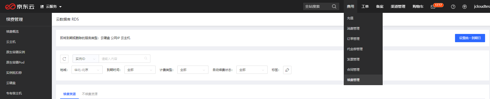
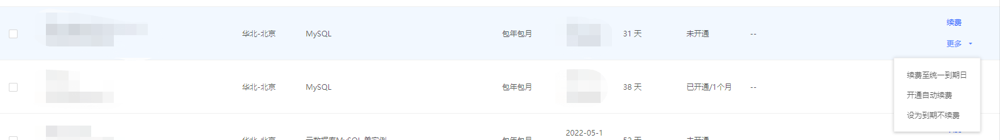
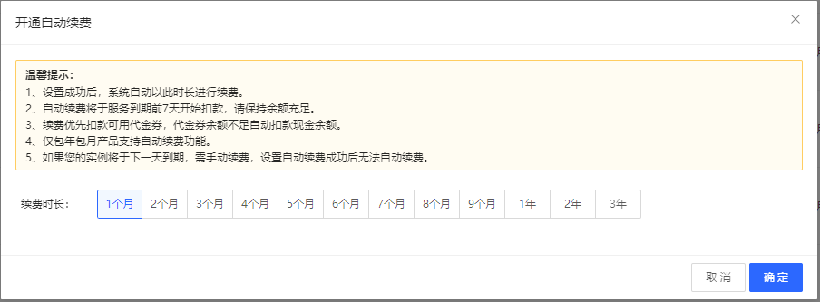

# 续费流程
## 续费实例
包年包月的实例到期后，京东云会为您的实例保留 7 天，但是在此期间实例是不可用的，7 天之后会彻底删除实例；建议在实例到期前进行相关的续费操作，确保实例一直可用；续费时候不支持进行配置变更，只能延长实例的到期时间，计费的详细标准，请参考[价格总览](./Price-Overview.md)。

## 注意事项
* 只有实例状态为 ***运行*** 的时候，才能进行续费操作。 

## 手动续费

* **操作流程**

1. 登录 [云数据库 RDS 控制台](https://rds-console.jdcloud.com/database)。
2. 变更实例计费类型的入口有两个，分别为
    * 列表页：选择需要变更计费类型的目标实例，点击 ***操作*** 这一列的 ***续费***。
    * 实例详情页：选择需要变更计费类型的目标实例，进入到实例详情页，点击页面右上角的 ***操作 -》续费***。
3. 续费的页面如下图

4. 阅读完云数据库 RDS 服务条款，点击去支付，按照提示完成后续操作。

## 自动续费

### 注意事项

* 自动续费首次扣款为实例到期前7天。若未扣款成功，则每天自动扣款一次，持续至实例到期日，若还是未成功，自动续费失败，需要您手动续费。为了避免影响您的业务，请保证您的账号余额充足
* 若您在自动扣款日期前进行了手动续费，系统将会在下一次到期前进行自动续费
* 自动续费功能于次日生效，若您的实例将于次日到期，请您进行手动续费，避免出现业务中断

### 购买实例时开通自动续费

* 在购买包年包月实例时，您可以直接勾选自动续费

### 购买实例后开通自动续费

1. 登录 [云数据库 RDS 控制台](https://rds-console.jdcloud.com/database)。
2. 在控制台的右上方，选择***费用***的***续费管理***

3.在续费或者不续费资源中找到目标实例，右侧单击***开通自动续费***

4.在弹出的对话框中，选择***自动续费周期***，点击***开通***

