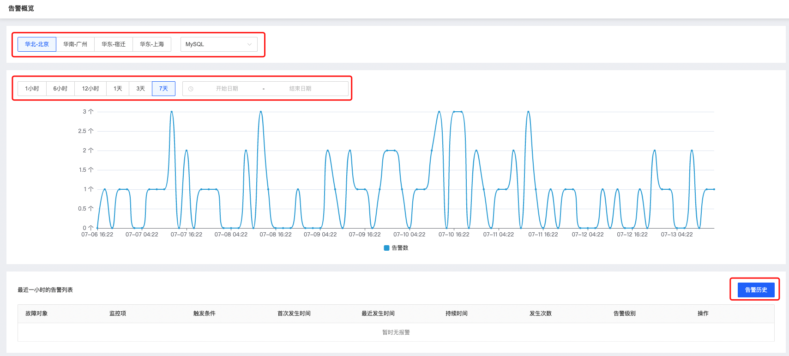
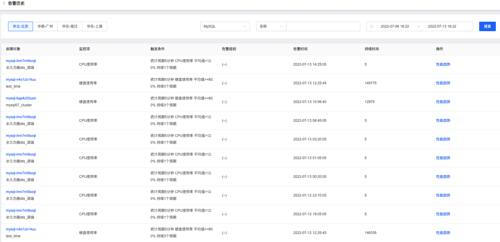

# 告警概览

通过SmartDBA的可查看告警趋势和告警概览页面。

## 操作步骤

1. 登陆京东云控制台，进入数据库自治服务SmartDBA管理页面；

2. 左侧导航栏选择**告警概览**，进入告警概览页可查看不同时间段的告警趋势以及告警历史；

3. 告警概览：您可以根据需要选择相应的时间段；

   

4. 查看告警历史：在告警概览页点击【告警历史】可查看告警历史

   
