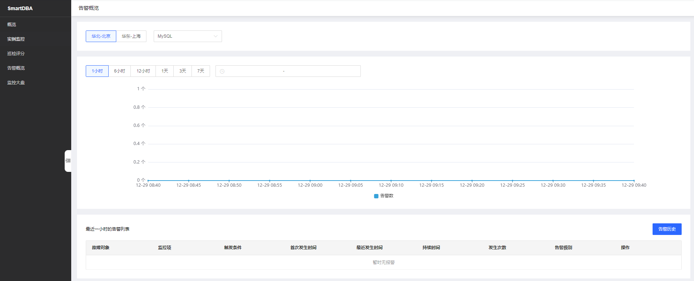
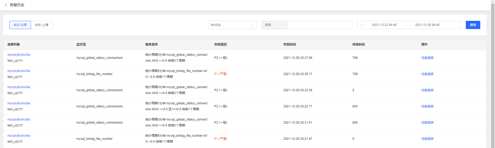

# 告警概览

通过SmartDBA的告警概览功能展示告警趋势和告警历史记录。

## 操作序列

* 通过左侧导航菜单的概览，异常告警卡片的告警概览。
* 通过左侧导航菜单的告警概览。

下图为告警概览页面：

* 告警趋势-折线图：按照时间维度展示告警的数量趋势.
         
    * 可选时间1小时，报警个数（每个区间 5 分钟）
    * 可选时间6小时，报警个数（每个区间 5 分钟）
    * 可选时间12小时，报警个数（每个区间 10 分钟）
    * 可选时间1天，报警个数（每个区间 30 分钟）
    * 可选时间3天，报警个数（每个区间 1 小时）
    * 可选时间7天，报警个数（每个区间 3 小时）
    * 可选时间1个月，报警个数（每个区间 12 小时）
	
* 近一小时告警列表说明
	
	| 字段         | 说明                                                         |
    | ------------ | ------------------------------------------------------------ |
    | 故障对象     | 展示告警的实例名称及id，ID高亮点击跳转实例详情页 |
    | 监控项       | 从云监控获取 |
    | 触发条件     | 从云监控获取 |
    | 首次发生时间 | 展示实例告警首次发生时间，时间格式：YYYY:MM:DD hh:mm:ss，精确到秒 |  
    | 最近发生时间 | 展示最近一次发生时间，时间格式：YYYY:MM:DD hh:mm:ss，精确到秒 |
    | 持续时间     | 告警持续时间展示，进行时间精度转换，60分钟内展示时间为分钟粒度，超过60分钟展示小时粒度，超过24小时展示天的粒度 |
    | 发生次数     | 告警持续时间内累计发生次数 |
    | 告警级别     | 分级：  P0（紧急）、P1（严重）、P2（一般）、P3（通知） |  

## 查看告警历史

在告警概览页点击【告警历史】后跳到告警历史页面，如下图：

* 告警历史说明
	
    | 字段          | 说明                                                         |
    | --------------| ------------------------------------------------------------ |
    | 故障对象      | 展示告警的实例名称及id，ID高亮点击跳转实例详情页 |
    | 监控项        | 从云监控获取 |
    | 触发条件      | 从云监控获取 |
    | 告警级别      |  分级：  P0（紧急）、P1（严重）、P2（一般）、P3（通知） |  
    | 告警时间      | 本次告警发生时间，时间格式：YYYY:MM:DD hh:mm:ss，精确到秒 |
    | 持续时间      | 告警持续时间展示，进行时间精度转换，60分钟内展示时间为分钟粒度，超过60分钟展示小时粒度，超过24小时展示天的粒度 |
