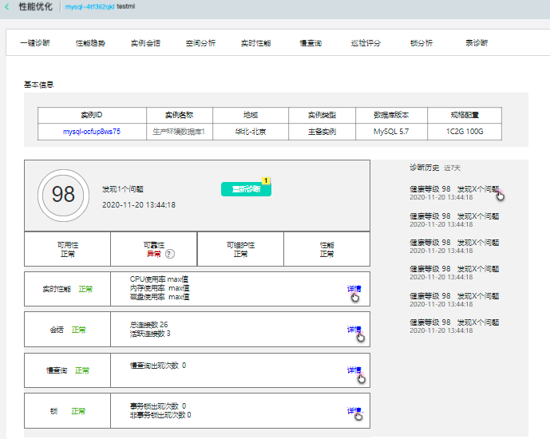
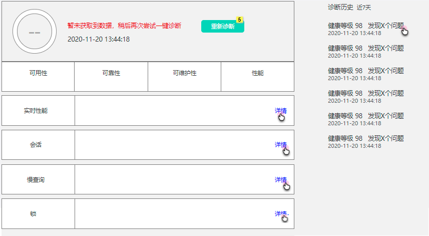

# 一键诊断
具体实例下的一键诊断功能，通过一键点击即可实时诊断出该实例的健康等级情况以及发现的问题，并且可以查看近7天的诊断历史情况。

## 前置条件
已创建目标实例，如MySQL实例

## 操作序列
控制台->数据库与缓存->SmartDBA->实例监控->实例监控详情->一键诊断。

一键诊断tab页如下：

 

## 执行诊断操作
1）进入一键巡检tab后，即执行诊断操作。
2）基本信息：展示实例ID（点击跳转 实例详情页）、实例名称、地域、实例类型、数据库版本、实例规格配置。
3）巡检项概览：判断指标项是否为正常，如正常展示为“正常”，异常则展示为：“异常 ”，鼠标悬浮展示异常说明提示信息。包含巡检项：可用性、可靠性、可维护性、性能、实时性能、会话、慢请求。

实时性能：包含cpu、内存、磁盘使用率，点击【详情】跳至当前实例实时性能页。
会话：包含总连接数、活跃连接数，点击【详情】跳至当前实例会话页。
慢请求：包含慢请求出现次数，点击【详情】跳至当前实例慢查询页。

 
## 重新诊断操作
点击【重新诊断】按钮也可以触发执行诊断操作。

## 查看诊断历史
展示近7天诊断历史，点击历史数据展示诊断信息，弹窗展示，内容样式同诊断详情。
 

