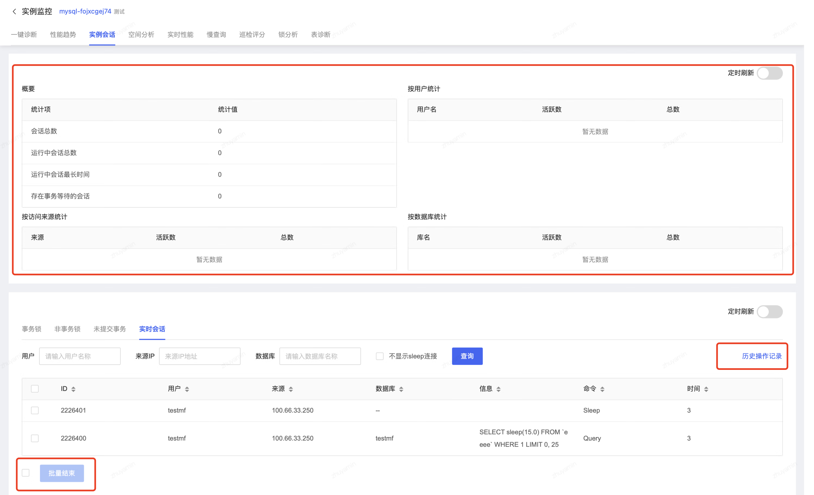
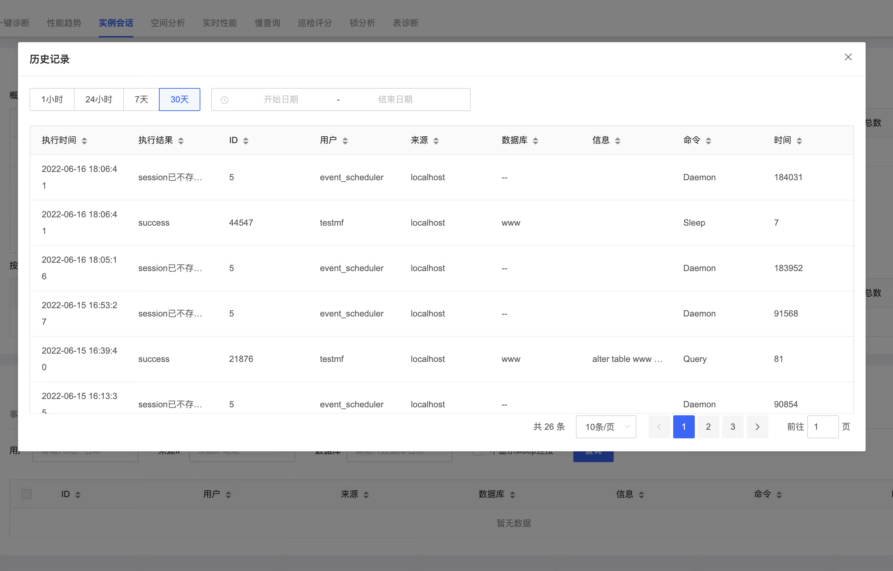

# 实例会话
您可以通过实例会话模块查看会话统计和明细数据、结束目标实例会话，同时支持查看和结束事务锁、非事务锁以及未提交事务。

## 操作步骤
1. 登陆京东云控制台，进入数据库自治服务SmartDBA管理页面；
2. 确保要监控的数据库实例已接入SmartDBA服务；
3. 左侧导航栏选择**实例监控**，进入实例监控列表页；
4. 找到目标实例，点击【性能监控】进入实例监控详情页面；
5. 选择**实例会话**Tab，在此页面下可以查看目标实例的会话统计信息，以及事务锁、非事务锁以、未提交事务、实时会话的明细数据；

6. 您可以在**会话统计**查看统计数据：

   * 会话概要：实例整体的会话数据，可查看会话总数、运行中的总会话数、运行中会话最长时间、存在事务等待的会话；

   * 按用户统计：按照用户维度汇总展示top用户的活跃会话和总会话数；

   * 按访问来源统计：按照访问来源维度汇总展示top用户的活跃会话和总会话数；

   * 按数据库统计：按照数据库维度汇总展示top用户的活跃会话和总会话数；

7. 您可以在**会话明细**中进行如下操作：

   * 查看事务锁、非事务锁以、未提交事务、实时会话的明细数据；

   * 结束事务锁、非事务锁以、未提交事务、实时会话；

   * 查看历史结束操作记录；

     
