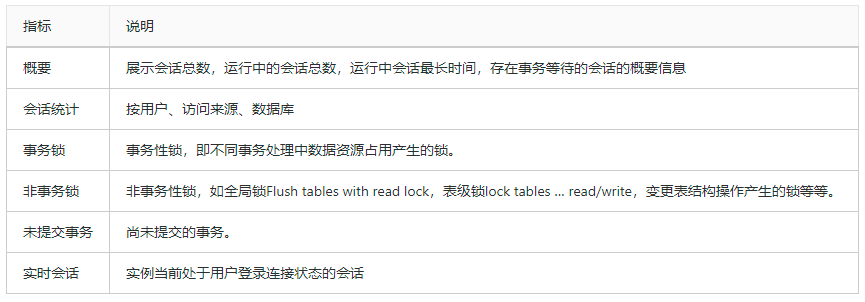
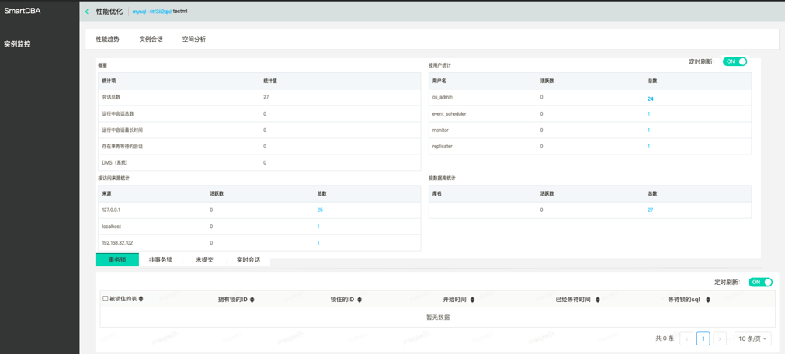
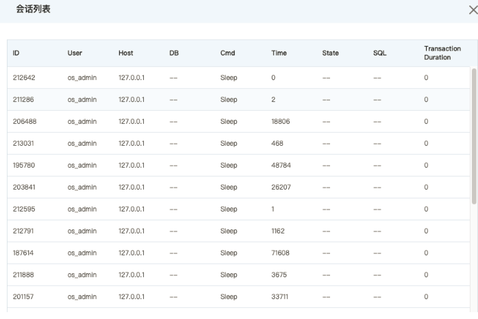
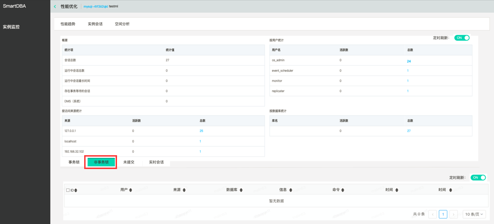
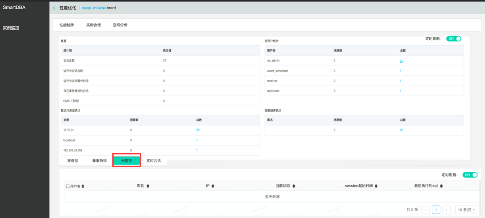
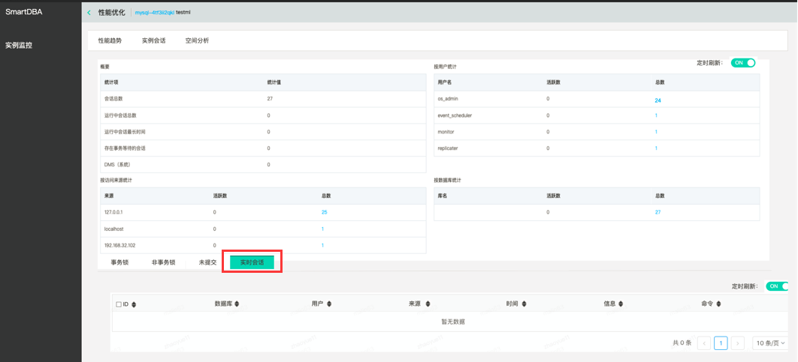

# 实例会话
会话信息统计，除概要为统计总值外，按用户统计、按访问来源统计、按数据库统计均取TOP5、会话明细，并对活跃会话进行分析分类，提取出事务锁，非事务锁（MDL等）以及未提交事务，可以快速定位问题。

## 前置条件
已创建目标实例，如MySQL实例

## 操作序列
控制台->数据库与缓存->SmartDBA->实例监控->实例监控详情->实例会话。

实例会话页如下：

 

点击各项统计数值可链接至会话明细弹窗，会话列表弹框如下：

 
 
对活跃会话进行分析分类，提取出事务锁，非事务锁（MDL等）以及未提交事务，可以快速定位问题。如下图：

 
 
 
