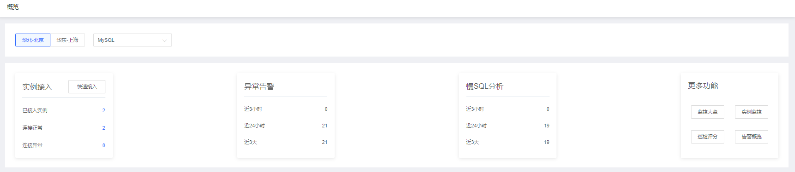
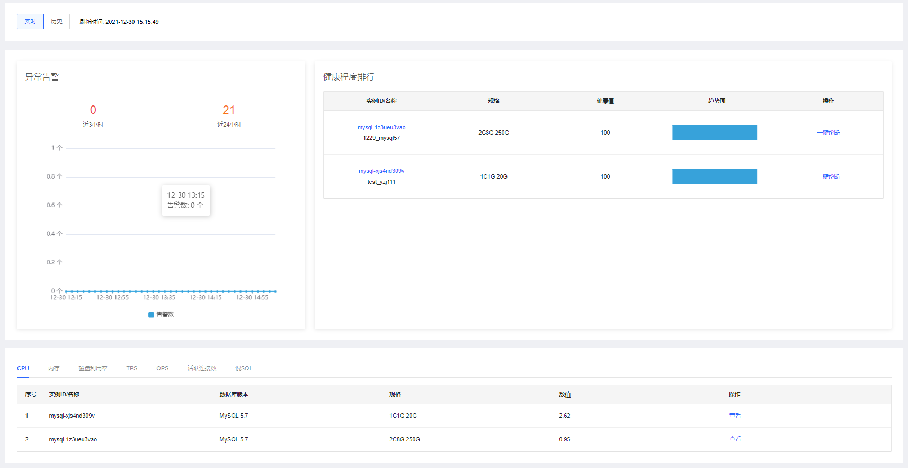

# 查看概览

通过SmartDBA的概览页直观地查看当前用户下实例接入，异常告警，慢SQL分析，更多功能等卡片统计及展示信息。并且可以查看实时和历史的异常告警图形、健康程度排行及服务器和数据库实例指标的列表展示等。

通过选择区域，以及数据库类型展示对应概览信息，默认选中华北-北京，MySQL数据库类型。
如下图：

* 实例接入：为接入到SmartDBA的实例数及连接正常和异常数。通过点击快速接入跳转到实例快速接入页面，相关操作见实例快速接入内容。
* 异常告警：展示近3小时，24小时，近3天的异常告警数。
* 慢SQL分析：展示近3小时，24小时，近3天的慢SQL数。
* 更多功能：点击后跳转到对应功能页面。

如下展示告警信息、健康程度排名以及列表展示实例性能top5排名。

* 实时按钮：点击实时按钮展示当前日期和时间点，如“刷新时间： 2021-09-07 14:48:59”。 
* 历史按钮：点击后展示日期和时间选择器，默认展示时间为当前日期和时间点。
* 异常告警
		 
	| 指标项       | 说明                                                         |
    | ------------ | ------------------------------------------------------------ |
    | 近3小时      | 展示实时或者所选时历史间点的前近3小时的告警数量 |
    | 近24小时     | 展示实时或者所选时历史间点的前近24小时的告警数量 |
    | 曲线图       | 展示实时或者所选时历史间点的近3小时的异常告警个数趋势，每5分钟一个点 |

* 健康程度排行
		    
展示健康等级最差的top5数据
			
| 列表项              | 说明                                                         |
| ------------------- | ------------------------------------------------------------ |
| 实例ID/实例名称     | 展示实例ID及名称，实例ID值，样式蓝色，点击实例ID跳转实例详情页 |
| 规格                | 展示实例规格信息 |
| 健康等级            | 取实时或者所选历史时间点的健康等级值 |
| 趋势图              | 展示实时或者所选历史时间点的近3小时的健康情况趋势，每10分钟一个点 |
