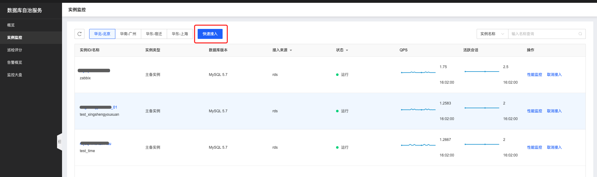
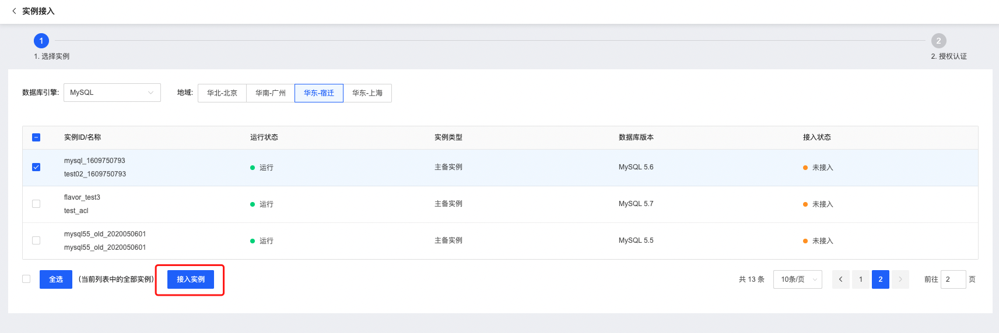
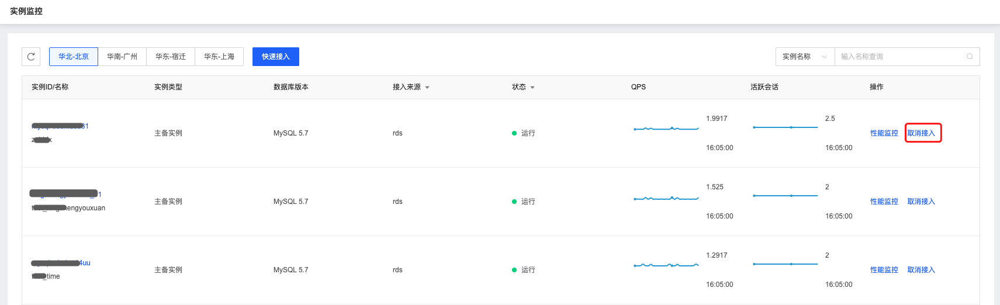

# 实例监控

数据库自治服务SmartDBA提供数据库实例接入和管理功能，您可以根据监控需要接入实例。目前支持接入的数据库类型：京东云RDS MySQL、Percona、StarDB。

## 操作步骤

1. 登陆京东云控制台，进入数据库自治服务SmartDBA管理页面；

2. 左侧导航栏选择**实例监控**，进入实例监控列表页，页面中展示历史接入的全部实例；

3. **性能监控**：点击【性能监控】可进入实例的详情页查看实例的一键诊断、实例会话、性能趋势、实时性能、表诊断、锁分析、慢日志、巡检报告等信息；

4. **实例接入与取消接入**：

   - 点击【快速接入】按钮进入选择实例页面，系统会根据您选择的地域和实例类型自动筛选出公有云实例；

     

   - 选择要接入SmartDBA的实例，点击【接入实例】即可完成接入；

     

   - 如果要取消，则在列表页点击【取消接入】即可；

     

