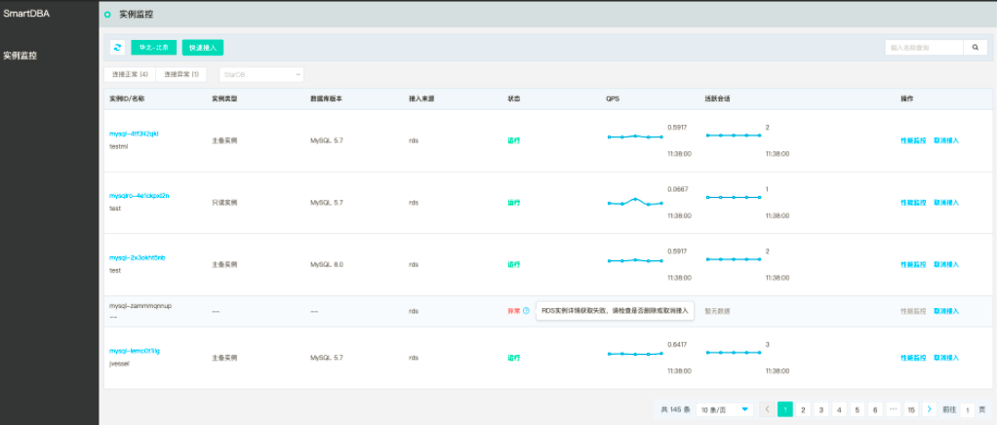
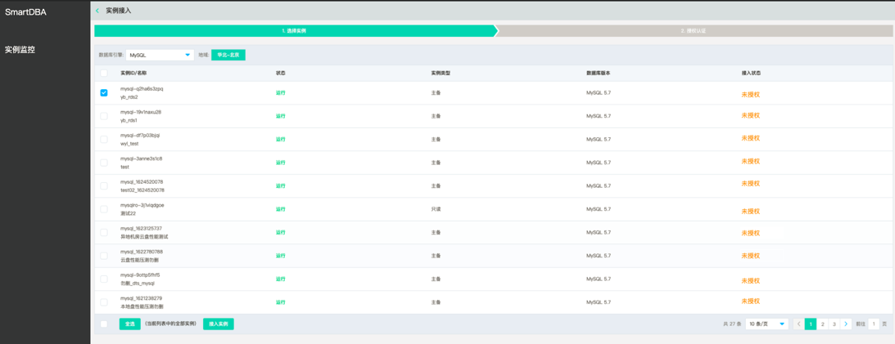

# 实例快速接入

选择实例，接入SmartDBA服务。

## 前置条件

* 已创建数据库实例，数据库类型目前支持MySQL、Percona
* 数据库实例已接入SmartDBA服务

## 操作入口

进入SmartDBA实例监控列表页，可以看到当前区域下的各个云数据库实例的基本信息。

点击【快速接入】按钮，进入实例接入页面。

 

实例接入包括选择实例和授权验证两个步骤，默认展示选择实例，在实例接入页面，点击实例接入左侧的返回符号，可返回至上一级实例监控页面。

接入实例：选择实例后，点击【接入实例】按钮跳转至下一步“授权认证页面”；未选择实例时，【接入实例】按钮禁止选择。

授权验证：进入该页面后，自动开始进行授权验证，并展示对应接入状态。
