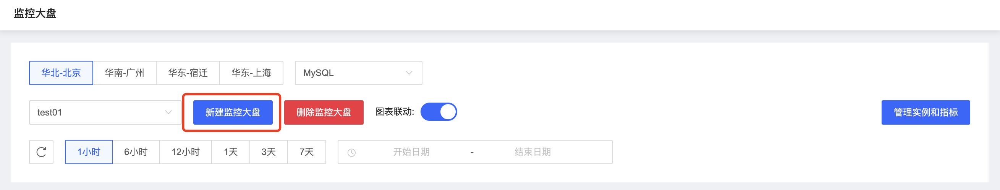
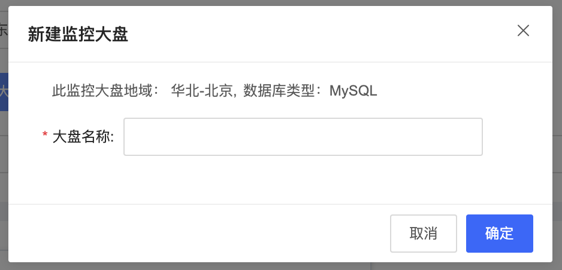
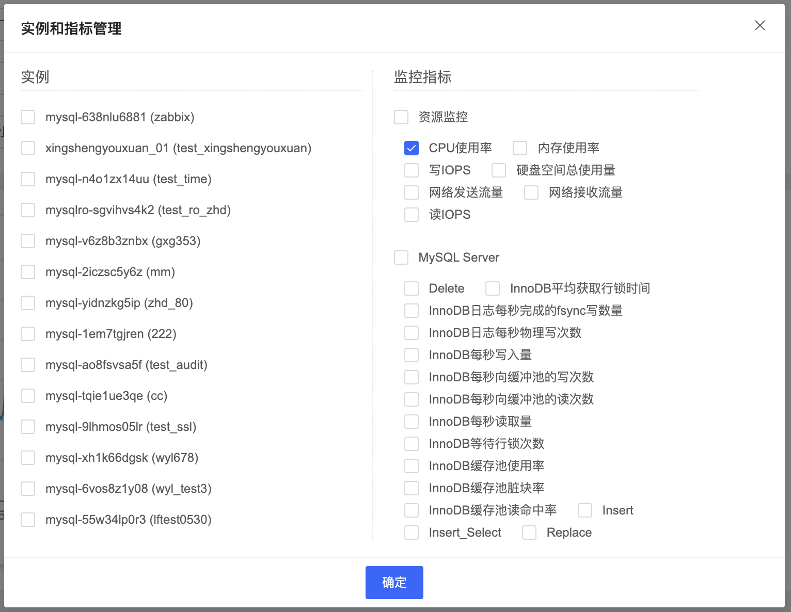

# 监控大盘

通过创建逻辑的监控大盘对象，用户可以自定义把相关实例进行监控信息统计展示。有助于用户对相关实例的整体性能监控分析。

## 操作步骤

1. 登陆京东云控制台，进入数据库自治服务SmartDBA管理页面；

2. 确保要监控的数据库实例已接入SmartDBA服务；

3. 左侧导航栏选择**监控大盘**，进入监控大盘页面，您可以根据需要自定义监控大盘的实例以及监控数据；

4. **新建大盘**：点击【新建监控大盘】，填写名称后点击确定创建大盘；

   

   

5. **管理实例和监控指标**：选择自己创建的大盘，点击【管理实例和指标】进行实例和指标管理，根据需要选择即可；

   

   

6. **查看大盘**：选择要查看的大盘，根据需要筛选时间即可查看大盘数据；

   

