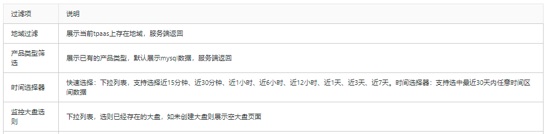

## 监控大盘
通过创建逻辑的监控大盘对象，用户可以自定义把相关实例进行监控信息统计展示。有助于用户对相关实例的整体性能监控分析。

 
### 添加大盘
填写监控大盘名称，点击确定创建大盘。
 

 
新增的大盘为空，如下图：

 
页面同监控大盘页面，无时间过滤项。
无监控监控图表，提示：“当前无监控图表，请 添加实例和指标。”
点击提示语中的“添加实例和指标”弹出 实例和指标管理弹窗。

### 添加实例和监控指标
页面勾选大盘钟需要统计的实例以及需要展示的指标。
每个指标单独一个监控图。
实例列仅展示当前已加入smartDBA且符合页面所筛选的地域以及产品类型。

 
### 查看大盘
### 过滤条件项

 
如下图：

 
