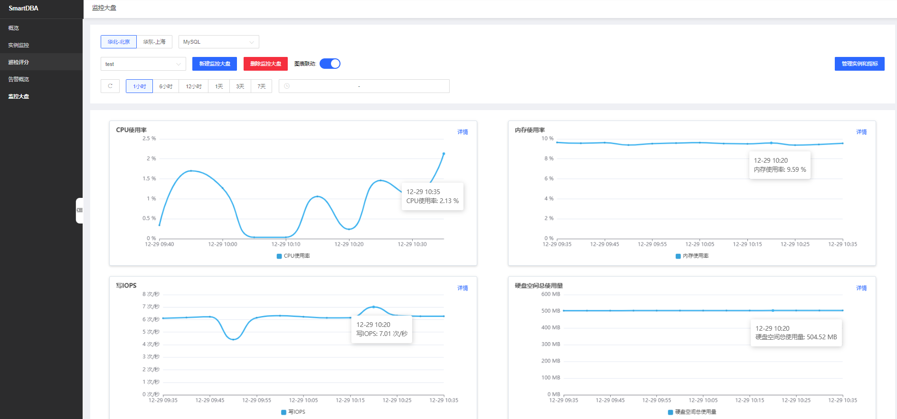
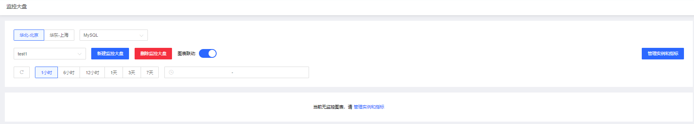
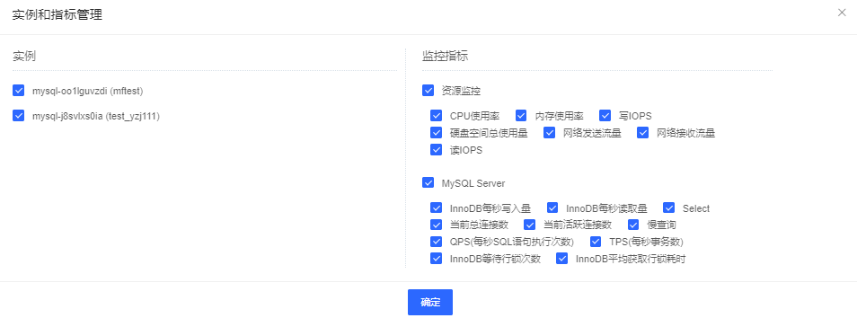

# 监控大盘

通过创建逻辑的监控大盘对象，用户可以自定义把相关实例进行监控信息统计展示。有助于用户对相关实例的整体性能监控分析。

## 添加大盘

填写监控大盘名称，点击确定创建大盘。

新增的大盘为空，如下图：

* 页面同监控大盘页面，无时间过滤项。

* 无监控监控图表，提示：“当前无监控图表，请 管理实例和指标。”

* 点击提示语中的“管理实例和指标”弹出 实例和指标管理弹窗。

## 添加实例和监控指标

* 页面勾选大盘钟需要统计的实例以及需要展示的指标。

* 每个指标单独一个监控图。

* 实例列仅展示当前已加入smartDBA且符合页面所筛选的地域以及产品类型。

| 指标                                  | 说明                                                         |
| ------------------------------------- | ------------------------------------------------------------ |
| CPU使用率                             | 实例的 CPU 使用率                                            |
| 内存使用率                            | 实例的内存使用率                                             |
| 硬盘空间使用量_总使用量               | 实例的磁盘空间使用量，包括硬盘空间总使用量、用户数据使用量、系统数据使用量和日志文件使用量。单位：MByte |
| 网络发送流量                          | 单位kbps                                                     | 
| 网络接收流量                          | 单位kbps                                                     | 
| 当前总连接数                          | 当前总连接数                                                             |
| 当前活跃连接数                        | 当前活跃连接数                                                             |
| 读IOPS                                | 实例每秒的 IO 次数，单位：次/秒                              |
| 写IOPS                                | 实例每秒的 IO 次数，单位：次/秒                              |
| select                                | QPS：实例中的select语句总和；tps：insert+delete+update语句的总和 |
| InnoDB每秒读取、InnoDB写入的数据量    | InnoDB 每秒读/写量（字节数）                                |
| 慢查询                                | 慢查询次数                                                   |
| 每秒SQL语句执行次数                   | 数据库每秒 SQL 语句执行次数，包括  Insert、Delete、Insert_Select、Replace、Replace_Select、Select、Update |
| 每秒事务数                            | 每秒事务数                                                   |
| InnoDB等待行锁次数                    |                                                              |
| InnoDB平均获取行锁耗时                |                                                              |

## 查看大盘

* 过滤条件项

	| 过滤项       | 说明                                                         |
    | ------------ | ------------------------------------------------------------ |
    | 地域过滤     | 展示当前tpaas上存在地域，服务端返回 |
    | 产品类型筛选 | 展示已有的产品类型，默认展示mysql数据，服务端返回 |
    | 时间选择器   | 快速选择：支持选择近1小时、近6小时、近12小时、近1天、近3天、近7天。时间选择器：支持选中最近30天内任意时间区间数据|
    | 监控大盘选则 | 下拉列表，选则已经存在的大盘，如未创建大盘则展示空大盘页面 |  

如下图：

