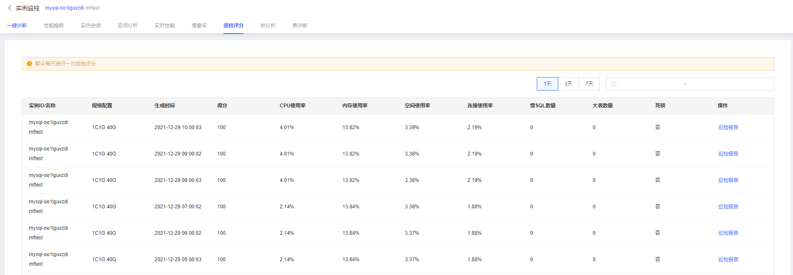
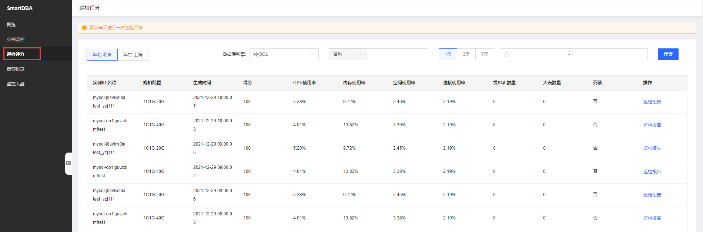
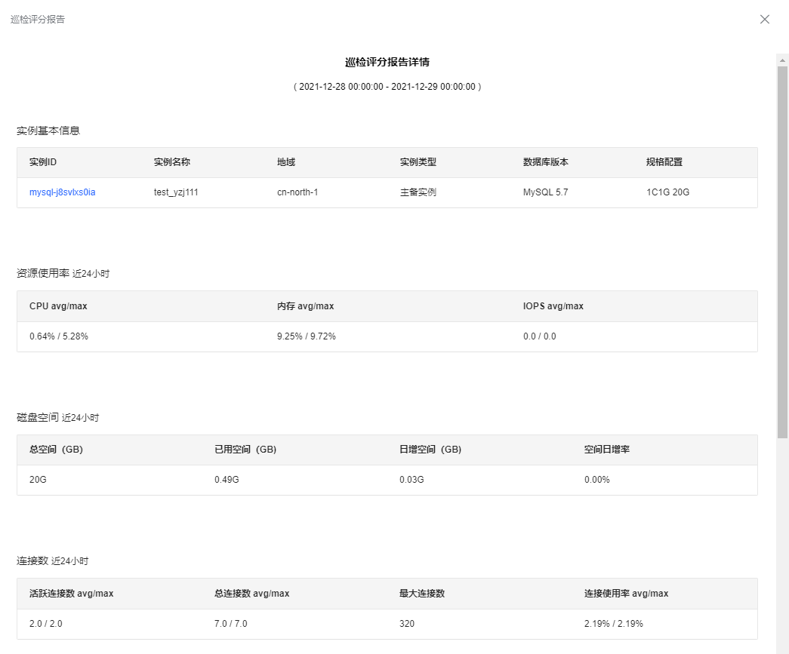

# 巡检评分
通过巡检评分功能可以综合服务器和数据库实例的多项指标，从宏观展示数据库实例的整体健康评分情况，并针对具体实例生成巡检评分报告。

## 前置条件

* 已创建数据库实例，数据库类型目前支持MySQL、Percona
* 数据库实例已接入SmartDBA服务

## 查看具体某一数据库实例的巡检评分
* 操作序列
* 控制台->数据库与缓存->SmartDBA->实例监控->实例监控详情->巡检评分。

 

## 查看用户下某一地域下的某一数据库类型的所有实例的巡检评分列表
* 操作序列     
* 控制台->数据库与缓存->SmartDBA->巡检评分

 

## 查看实例巡检报告
点击操作下的巡检报告，即可弹出实例对应生成日期的巡检报告，如下：

 

巡检报告为每天运行一次巡检评分的自动发起。

## 删除实例巡检报告
根据用户使用需要，也可点击删除巡检报告。

