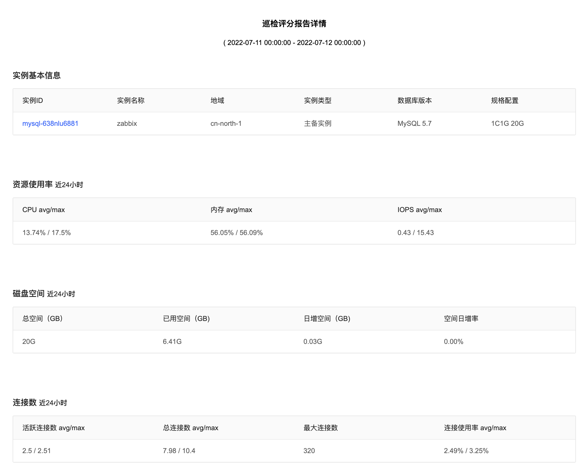

# 巡检评分
SmartDBA通过巡检评分功能可以综合服务器和数据库实例的多项指标，从宏观展示数据库实例的整体健康评分情况，并针对具体实例生成巡检评分报告。

## 操作步骤

1. 登陆京东云控制台，进入数据库自治服务SmartDBA管理页面；

2. 确保要监控的数据库实例已接入SmartDBA服务；

3. **入口一**：左侧导航栏选择**实例监控**，找到目标实例，点击【性能监控】进去详情，选择**巡检评分**Tab；

4. **入口二**：左侧导航栏选择**巡检评分**，根据需要筛选地域、数据库类型、目标实例、时间进行巡检信息查看；

5. 巡检报告每日定时自动发起一次巡检，并生成巡检报告；

6. 查看具体某一数据库实例的巡检评分；

   

7. 查看用户下某一地域下的某一数据库类型的所有实例的巡检评分列表；

   

8. 查看巡检报告：点击【巡检报告】可查看巡检报告详情；

   

 

