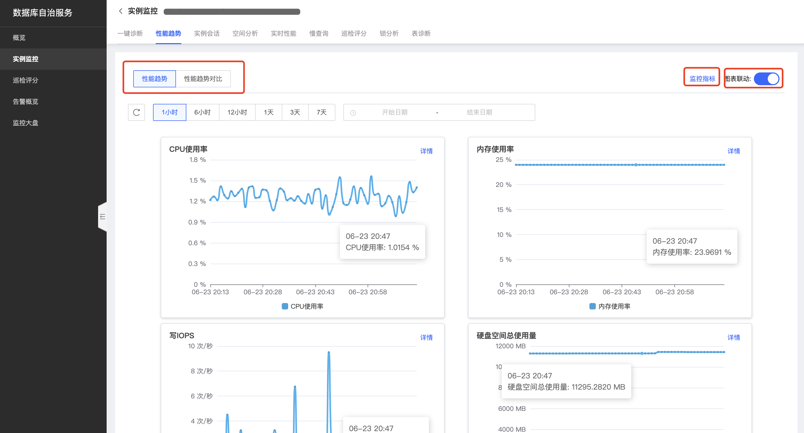
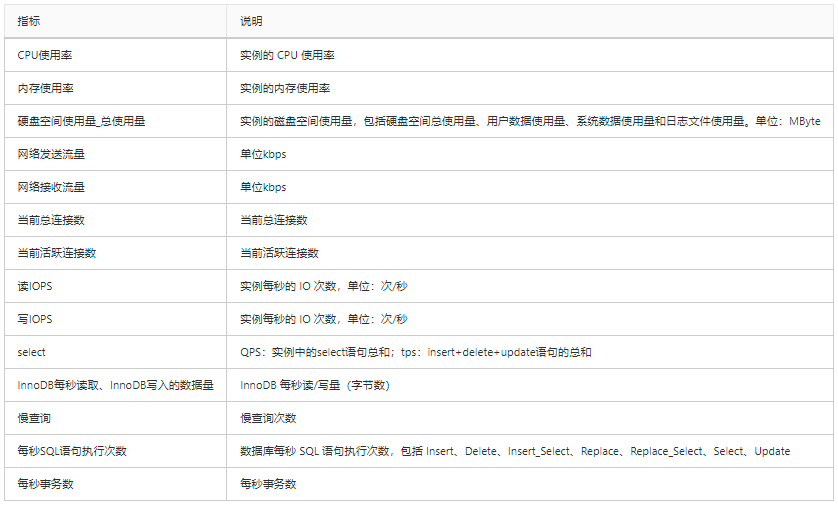
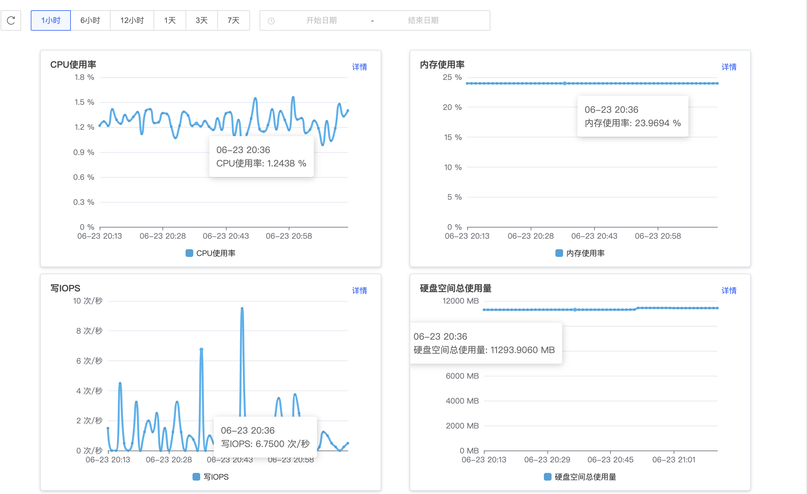
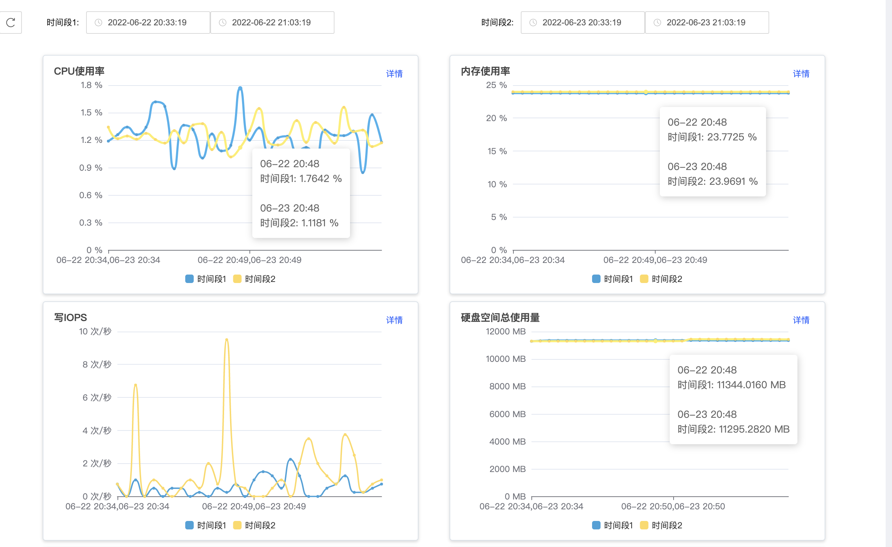

# 性能趋势
数据库自治服务SmartDBA提供性能趋势功能，支持选择不同时间维度查看性能趋势，同时支持自定义时间段对比查看性能趋势，系统支持自定义性能指标和多性能指标趋势的联动对比查看等。

## 前置条件
* 已创建数据库实例，数据库类型目前支持MySQL、Percona
* 数据库实例已接入SmartDBA服务

## 操作步骤
1. 登陆京东云控制台，进入数据库自治服务SmartDBA管理页面；
2. 左侧导航栏选择**实例监控**，进入实例监控列表页；
3. 找到目标实例，点击【性能监控】进入实例监控详情页面；
4. 选择**性能趋势**Tab，进入性能趋势页面查看性能监控信息；

## 功能说明

### 支持监控指标项

### 查看性能趋势图
* 用户可根据运维监控需要查看数据库实例性能趋势图；
* 支持自定义时间范围和监控指标；
* 系统默认开启图标联动，方便查看同时间的不同指标数据；

### 查看性能趋势对比图
* 用户可根据运维监控需要查看数据库实例性能趋势对比，方便查询不同时间段的数据指标情况；
* 支持自定义时间范围和监控指标；
*  
