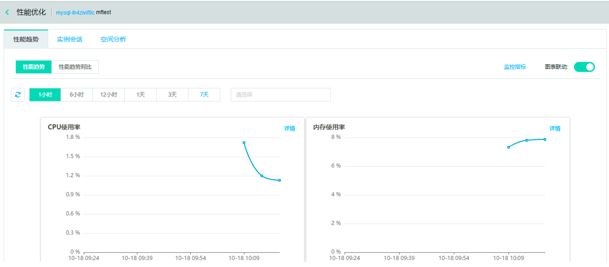
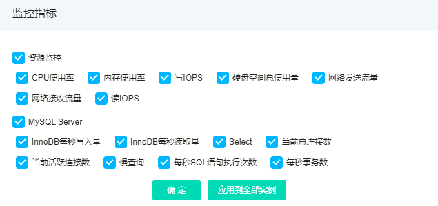
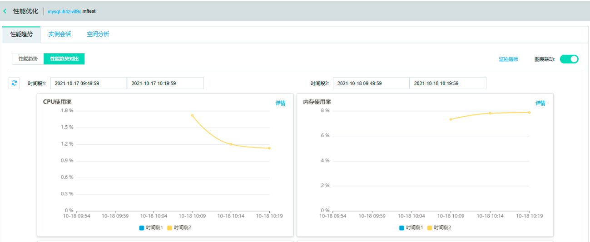

# 性能趋势
提供性能趋势功能，不仅支持多种性能指标的选择，也支持性能趋势的多种查看方式，包括单性能指标趋势的细粒度查看，多性能指标趋势的联动对比查看等。

## 前置条件
已创建目标实例，如MySQL实例

## 操作序列
控制台->数据库与缓存->SmartDBA->实例监控->实例监控详情->性能趋势。

## 支持监控指标项

 
## 查看性能趋势图
点击【性能趋势】按钮后显示监控指标项的性能趋势图，默认全选并按序展示，默认开启图表联动。

性能趋势页如下：

 
## 查看部分监控指标项性能趋势图
展示顺序和勾选顺序有关，如下图：
 

 
## 查看性能趋势对比图
点击【性能趋势对比】按钮后显示监控指标项的性能趋势对比图，默认全选并按序展示，默认开启图表联动。

性能趋势对比页如下：

 
## 查看部分监控指标项性能趋势对比图
展示顺序和勾选顺序有关，如下图：

 
