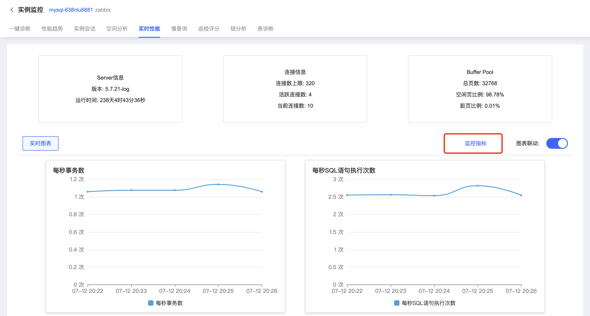
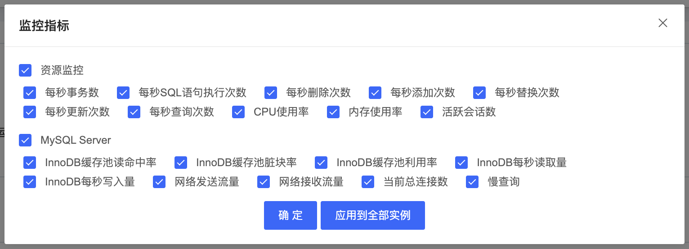

# 实时性能
SmartDBA提供数据库实时性能指标查看，您可以根据运维需要实时查看性能数据。

## 操作序列

1. 登陆京东云控制台，进入数据库自治服务SmartDBA管理页面；

2. 确保要监控的数据库实例已接入SmartDBA服务；

3. 左侧导航栏选择**实例监控**，进入实例监控列表页；

4. 找到目标实例，点击【性能监控】进入实例监控详情页面；

5. 选择**实时性能**Tab，进入页面查看实例实时性能指标情况；实时性能默认展示近5分钟的指标数据；

   

6. 可根据查看监控需要选择要查看的指标；

   

