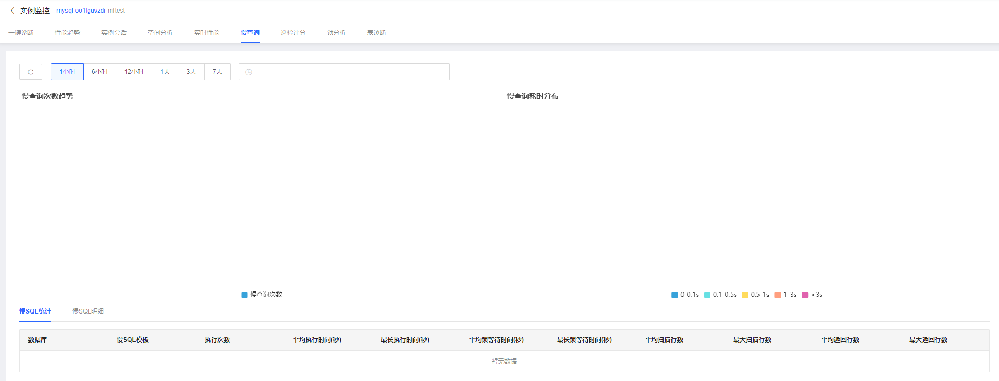

# 慢查询

通过慢查询功能可以图形化展示慢查询次数趋势和慢查询耗时分布折线图，并且通过列表展示慢SQL统计和慢SQL明细情况，让用户查看获取慢SQL更加详细的信息，以及诊断慢SQL，展示优化建议。

## 操作步骤

1. 登陆京东云控制台，进入数据库自治服务SmartDBA管理页面；

2. 确保要监控的数据库实例已接入SmartDBA服务；

3. 左侧导航栏选择**实例监控**，进入实例监控列表页；

4. 找到目标实例，点击【性能监控】进入实例监控详情页面；

5. 选择**慢查询**Tab，进入页面查看实例的慢查询情况，首先您需要选择查看的时间段，可以选择近1小时、近6小时、近12小时、近1天、近3天、近7天，也可以自定义时间段，时间段最长支持7天；

   

   * **慢日志趋势**：展示慢查询次数趋势和慢查询耗时分布
   	* 慢查询次数：展示时间周期内，慢查询次数折线图；
   	* 慢查询耗时分布：按照0-0.1s，0.1-0.5s，0.5-1s，1-3s和>3s展示慢查询的分布情况；
   	

   * **慢SQL统计**：按照数据库和SQL模板维度汇总数据，查看同类型模板的SQL的平均运行情况；
   * **慢SQL明细**：您可以在慢SQL明细中查看慢SQL明细并可以通过点击【优化】操作查看慢SQL的优化建议；

