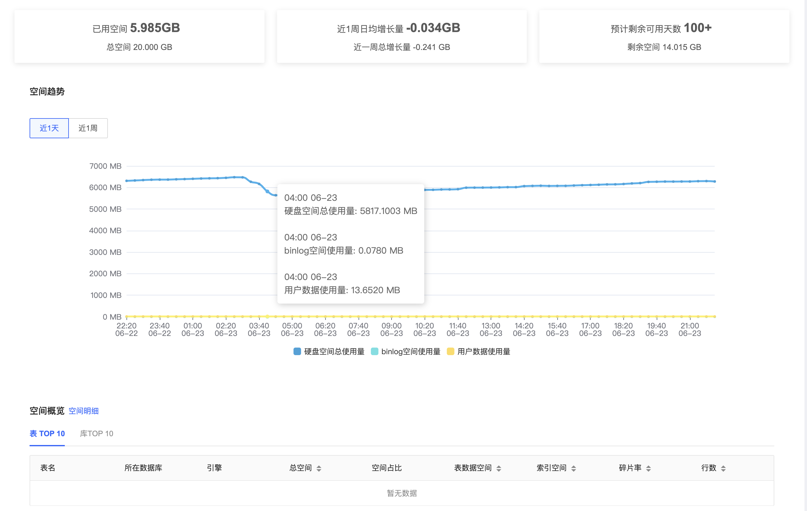
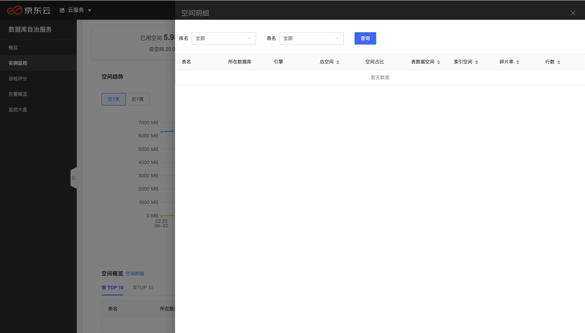

# 空间分析
通过SmartDBA的空间分析功能直观地查看某个数据库实例的空间使用概况、近一周使用空间增长、空间剩余可用天数，以及实例中top10的库、表的空间使用情况、空间碎片率、行数等信息

## 前置条件

* 已创建数据库实例，数据库类型目前支持MySQL、Percona
* 数据库实例已接入SmartDBA服务

## 操作步骤

1. 登陆京东云控制台，进入数据库自治服务SmartDBA管理页面；
2. 左侧导航栏选择**实例监控**，进入实例监控列表页；
3. 找到目标实例，点击【性能监控】进入实例监控详情页面；
4. 选择**空间分析**Tab，进入页面查看实例的空间使用情况；

## 功能说明

### 概览信息

* 用户可以根据空间概览信息直观的了解到当前实例的空间总量，已使用量，以及近一周的增长和剩余可以用天数；

### 空间趋势

* 空间趋势直观的展现近1天、近一周的空间使用量变化曲线，用户可以根据趋势图了解业务空间的使用情况；

### 空间明细

* 用户可以了解查看空间使用top10的表和库的空间明细情况；

* 点击【**表明细**】支持根据库名、表名查询实例下各个表的空间使用明细信息；

  
