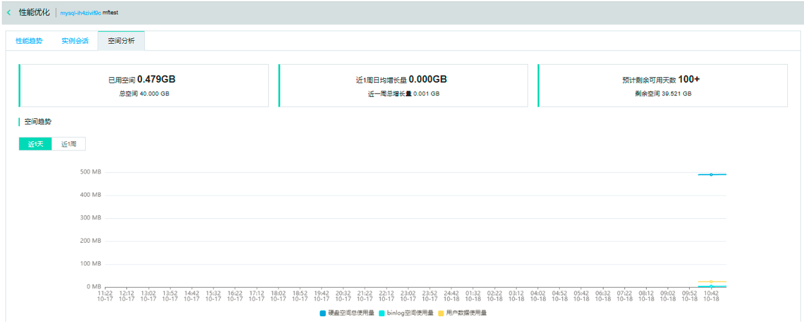

# 空间分析
通过SmartDBA的空间分析功能直观地查看某个数据库实例的空间使用概况、空间剩余可用天数，等空间使用情况。

## 前置条件
已创建目标实例，如MySQL实例

## 操作序列
控制台->数据库与缓存->SmartDBA->实例监控->实例监控详情->空间分析。

空间分析页如下：

  
点击【近1天】【近1周】查看对应磁盘空间总使用量、用户数据使用量、binlog空间使用量。

