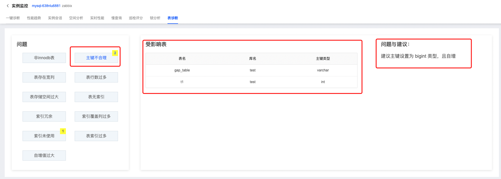

# 表诊断

SmartDBA的表诊断模块提供实时表问题诊断能力，系统对表的常见问题进行诊断以及分类展示，并对问题提出详细的优化建议，帮助您更好的管理数据库。

## 操作步骤

1. 登陆京东云控制台，进入数据库自治服务SmartDBA管理页面；
2. 确保要监控的数据库实例已接入SmartDBA服务；
3. 左侧导航栏选择**实例监控**，进入实例监控列表页；
4. 找到目标实例，点击【性能监控】进入实例监控详情页面；
5. 选择**表诊断**Tab，进入诊断页面查看问题，点击问题类型，可查看当前问题受影响的表详情和问题的优化建议；

## 诊断问题说明

| 诊断问题       | 问题说明                                                     |
| -------------- | ------------------------------------------------------------ |
| 非Innodb表     | 建议修改表引擎为innodb，以支持事务操作                       |
| 主键不合理     | 建议主键设置为 bigint 类型，且自增，以提高查询性能           |
| 表存在宽列     | 表中存在text,blob,varchar>500等字段，改小以防止行溢出        |
| 表行数过多     | 单表行数超过500万，建议把数据归档或者删除，以提高查询性能    |
| 表存储空间过大 | 单表数据量超过100GB，建议把数据归档或者删除，以提高查询性能  |
| 表无索引       | 表无主键且无合理索引，会致查询效率低下，建议添加主键/索引，以提高查询性能 |
| 索引冗余       | 表中存在冗余索引，建议删除，以清理空间，优化dml性能          |
| 索引覆盖列过多 | 表中存在单个索引涵盖超过5个列，建议优化索引                  |
| 索引未使用     | 表中索引创建但未使用，建议删除，以清理空间，优化dml性能      |
| 表索引过多     | 表中索引超过6个，维护成本大，建议优化索引                    |
| 自增值过大     | 当前自增序列值过大，已达最大值的80%，可能有溢出风险          |

