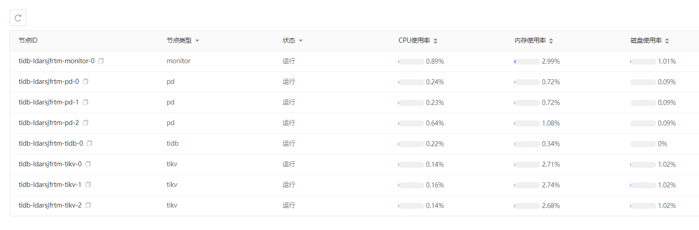

# 节点信息
可以查看集群中各个节点的状态及CPU、内存、存储等核心性能指标。 这部分指标共享云监控的数据，是上一个采集周期的性能数据，并不是当前的实时数据。

> **注意**：这部分指标共享云监控的数据，是上一个采集周期的性能数据，并不是当前的实时数据。

## 操作步骤
1. 点击实例名，进入实例页面，选择 **节点信息**。
2. 点击表头中相应的列，可以对数据进行过滤或者排序
  - 节点类型、状态：支持过滤
  - CPU，内存、存储：支持排序
3. 点击节点的具体指标，可以查看该指标的历史数据。

