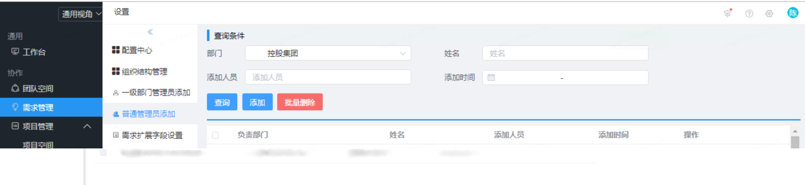
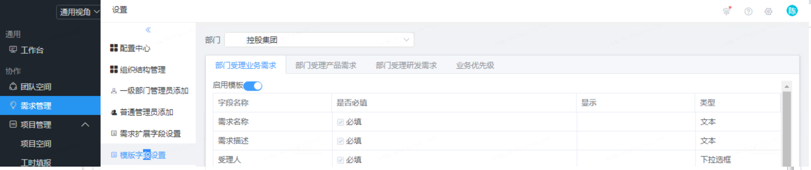

平台提供简单的个性化配置，该项目由各阶层管理员来完成。 未来我们将提供更灵活的权限功能，满足不同角色的个性化配置需求。

不同层级的管理员拥有不同的管理权限，高权限成员可以为低权限成员分配权限。

## 一级管理员

一级管理员可以增加、删除、修改、查询普通管理员，同时拥有普通管理员的所有权限

!> 一级管理员由超级管理员来配置

## 普通管理员

在行云中，普通管理员可以对需求的流程进行相应设置。

- 需求管理模块设置：对该模块必填内容进行设置

- 白名单设置：开启后，仅白名单人员允许提报或接受需求

- 业务需求流程设置：针对需要走审批流程的部门，可以对业务需求设置相应审批人

