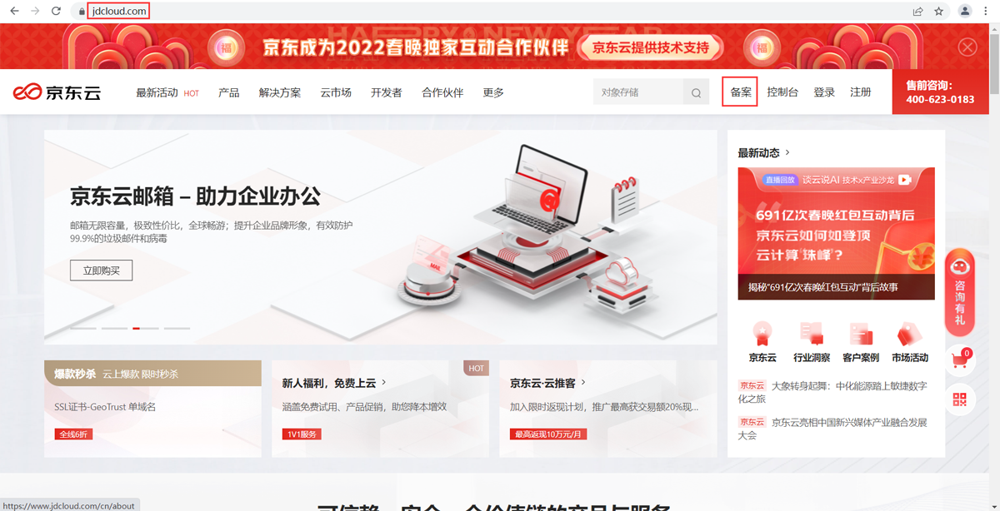
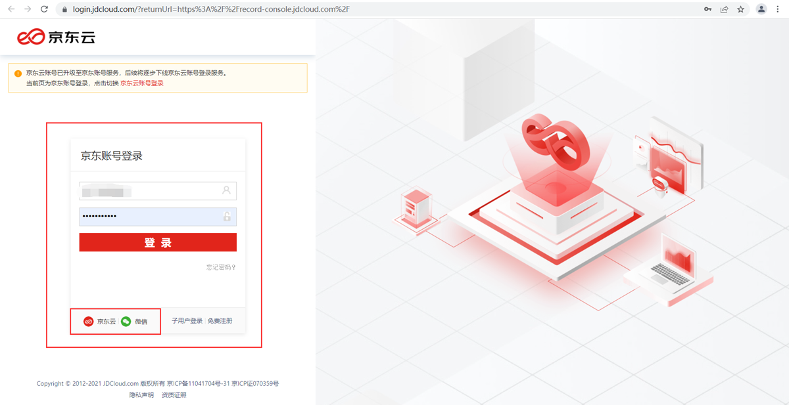
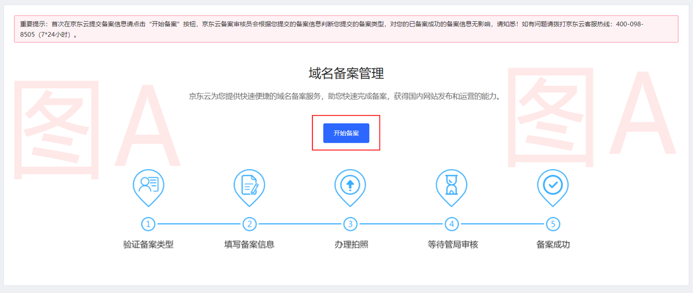
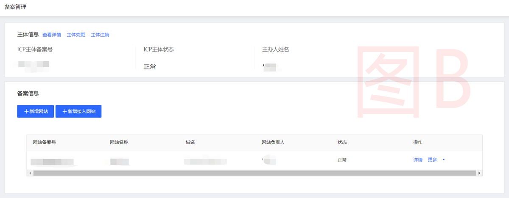

## 备案简介

根据国务院令第292号《互联网信息服务管理办法》和《非经营性互联网信息服务备案管理办法》规定，国家对经营性互联网信息服务实行许可制度，对非经营性互联网信息服务实行备案制度。未获取许可或者未履行备案手续的，不得从事互联网信息服务，否则属于违法行为。

因此，所有对中国大陆境内提供服务的网站都必须先进行 ICP 备案，备案成功并获取通信管理局下发的 ICP 备案号后才能开通访问。更多相关法律法规请参阅[工业和信息化部政策文件](https://beian.miit.gov.cn/#/Integrated/lawStatute)。

---

## 新手引导

**打开[**京东云官网**](https://www.jdcloud.com)首页,点击右上角处"备案"按钮**



**进入登录页面，选择您可登录的方式**

```
说明：支持京东账号、京东云账号及微信账号登录，子账号不支持备案。
```



**登入备案系统后，选择适合自己的帮助文档以帮助您顺利完成备案**
- 登入备案系统后，若显示图A效果，则代表此账号未在京东云完成过备案，请移步至[第一次来京东备案看这里](without-Organizer.md)
- 登入备案系统后，若显示图B效果，则代表此账号在京东云完成过备案，请移步至[京东有备案记录的看这里](Existence-record.md)






