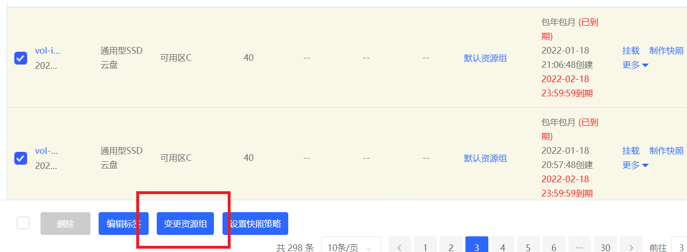

# 资源组

## 应用场景

资源指的是具有特定功能的实体（例如云盘、云主机、数据库），资源组（Resource group）可以理解为资源的集合，资源组可以对其中的资源定义关系和约束，从而更加高效的进行资源管理。资源组具有以下功能：

- 方便对其中的资源执行批量操作：例如应用更新或安全补丁、升级应用程序、打开或关闭网络端口、收集日志和监控数据等
- 实现子账号间基于资源粒度的权限控制：例如将产品和其下设备分别打上对应的资源组标签，便可以通过资源的标识限制子账号的访问权限
- 分账功能：在项目中创建多个资源组，将资源组的资源添加到同名的财务单元中，让财务部门可以根据财务单元进行出账， 解决财务成本分摊的问题

## 功能说明

1. 所有新创建的硬盘资源如未指定资源组，将会被分配到默认资源组中，后续用户可根据自身需要进行调整。

2. 可根据资源组ID进行条件筛选，支持多个资源组同时查询。

   

3. 支持批量变更资源组，选择对应实例后，通过列表下方“变更资源组”按钮，进行统一调整。

  
