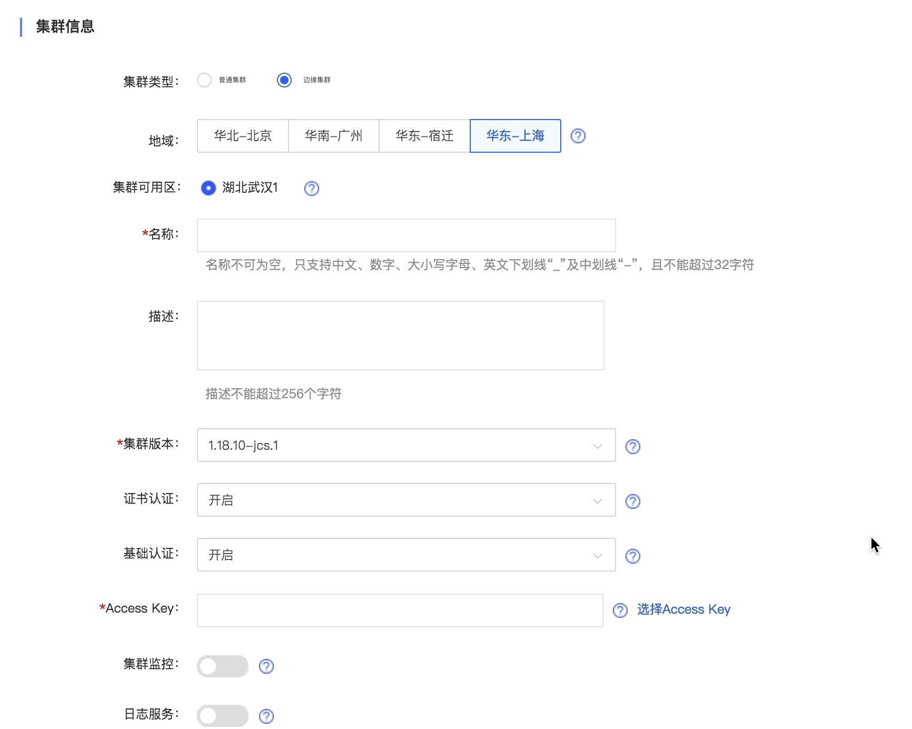

# 创建边缘集群

## 确认地域及实例配置
**确定实例所在地域**

京东云不同地域之间完全隔离，保证不同地域间最大程度的稳定性和容错性。当前边缘集群只覆盖华东-上海地域，未来我们将逐步增加更多服务地域
目前边缘集群在华东-上海灰度发布，如要使用边缘集群，请申请使用。[工单](https://ticket.jdcloud.com/myorder/form?cateId=1&questionId=410)

## 创建集群

 1. 打开控制台，选择[弹性计算>>容器服务Kubernetes>>集群服务>>集群](https://cns-console.jdcloud.com/host/kubernetes/list)   
 2. 点击创建，进入创建页面，如果申请开通边缘集群的权限，会有集群类型的选项
   
 4. 选择边缘集群
 5. 地域选择华东-上海，可用区选择湖北武汉1
 6. 设置名称、描述：名称不可为空，只支持中文、数字、大小写字母、英文下划线 “ _ ”及中划线 “ - ”，且不能超过32字符；描述为非必填项，长度不超过256字符。

 6. 集群版本：目前支持1.16和1.18版本。

 7. 证书认证、基础认证：默认全部开启，建议全部保留；需要至少保留一个为开启状态；
  * 证书认证：基于base64编码的证书，用于客户端到集群服务端点的认证；建议开启证书认证；
  * 基础认证：开启后允许客户端使用用户名、密码在集群服务端点认证。

 8. 添加Accesskey：选择启动状态下的Accesskey；如果无可用Access Key，请前往Access Key管理页面创建新的Access Key，并在开启状态。可参考[Accesskey管理](https://docs.jdcloud.com/cn/account-management/accesskey-management)。

## 网络配置

网络配置指选择部署工作节点组资源的私有网络：
  * 网络配置支持普通模式和自定义模式两种模式，一般用户推荐使用普通模式
  * 私有网络，用来创建Kubernetes集群的私有网络
  * 工作节点CIDR，京东云将在选择的工作节点CIDR中新建四个子网，包括工作节点子网、Pod子网、Service子网和Service-LB子网，并为每个子网新建一个路由表；
  * 工作节点网络类型，支持NAT和公网，如果选择NAT网关会自动创建带公网ip的nat虚机，用于node，pod出公网，所以请至少保留一个公网ip的配额
  * 创建VPC私有网络，详见[私有网络](http://docs.jdcloud.com/cn/virtual-private-cloud/product-overview)和[子网](http://docs.jdcloud.com/cn/virtual-private-cloud/subnet-features)。并在集群创建时选择相应的VPC，勾选“自动分配IPv6地址”。
    * 上述私有网络中新建的子网CIDR与私有网络中其他已创建的子网CIDR不能重叠；详情参考[子网配置](https://docs.jdcloud.com/cn/virtual-private-cloud/subnet-configuration)；
    * 工作节点组与管理节点将通过VPC对等连接网络互通，因此已选择的工作节点CIDR与管理节点CIDR不能重叠；详情参考[VPC对等连接](https://docs.jdcloud.com/cn/virtual-private-cloud/vpc-peering-configuration)；
    * 为了避免因CIDR重叠导致工作节点相关的子网无法创建，建议[新建私有网络](https://docs.jdcloud.com/cn/virtual-private-cloud/vpc-configuration)；
    * 工作节点CIDR取值范围为16 ~ 18。
  * 管理节点CIDR，默认自动选择，系统会自动创建一个和工作节点CIDR不冲突的管理节点子网，建立VPC对等连接。

创建集群时会对私有网络的相关配额进行校验，请保证私有网络相关配额充足，详情参考[私有网络使用限制](https://docs.jdcloud.com/cn/virtual-private-cloud/restrictions)。

## 新建工作节点组  

创建新集群时需要添加一个工作节点组，在创建集群页面上即可配置工作节点组相关的参数。

1. 操作系统：目前Windows集群和Linux集群分别支持一个操作系统版本

2. 工作组可用区： 默认可用区与集群可用区一致，可根据实际需要选择一个或多个可用区，可选项为集群可用区子集，至少保证有一个可用区被选中。

3. 规格：根据具体业务情况选择不同工作节点规格类型，支持云主机第二代规格和GPU型实例规格。可参考[实例规格类型](https://docs.jdcloud.com/cn/virtual-machines/instance-type-family)。
  * 京东云使用云主机做为集群的工作节点；
  * 每个工作节点组内的工作节点具有相同的规格类型;
  * 您可以为集群[添加多个节点组](https://docs.jdcloud.com/cn/jcs-for-kubernetes/create-nodegroup)，每个节点组指定不同的规格类型，以满足不同类型的应用负载对实例规格的需求；
  
4. 系统盘：根据所选规格不同，分别支持容量型HDD，通用型SSD，性能型SSD和本地盘

5. 数量：默认数量为3，可根据需求点击增加、减少按键或者直接输入预期节点数量；工作节点最大数量受当前地域[云主机配额](https://docs.jdcloud.com/cn/virtual-machines/restrictions)、工作节点子网CIDR可分配的内网IP数量限制。
  * 每增加一个工作节点将在指定地域/可用区内新建一个云主机；
  * 如需对集群的节点数量进行调整，您可以对指定节点组进行[手动伸缩](https://docs.jdcloud.com/cn/jcs-for-kubernetes/telescopic-nodegroup)或通过[添加工作节点组](https://docs.jdcloud.com/cn/jcs-for-kubernetes/create-nodegroup)、[删除工作节点组](https://docs.jdcloud.com/cn/jcs-for-kubernetes/delete-nodegroup)的方式进行；

6. 名称：默认名称为nodegroup1，名称不可为空，只支持中文、数字、大小写字母、英文下划线“_”及中划线“-”，且不能超过32字符。同一集群下的工作节点组不可重名。

7.  以下为高级选项，非必填项：  
  * 描述：描述不能超过256个字符；
  * 登录密码：节点SSH登录密码，用户为root
  * 标签：设置添加到工作节点上标签的键、值；键由前缀和名称组成；前缀不超过253字符，由DNS子域名组成，每个子域名不超过63字符，且必须以小写字母数字起止，可包含“-”“.”、大小写字母和数字；名称和值均不能超过63字符，必须以大小写字母或数字起止，可包含“-”“ _ ”“.”、大小写字母和数字；最多可添加五组标签。

8. 完成相关设置后，点击确定，即可进入弹性计算>>容器服务Kubernetes>>集群服务>>工作节点组，查看创建的工作节点组。
