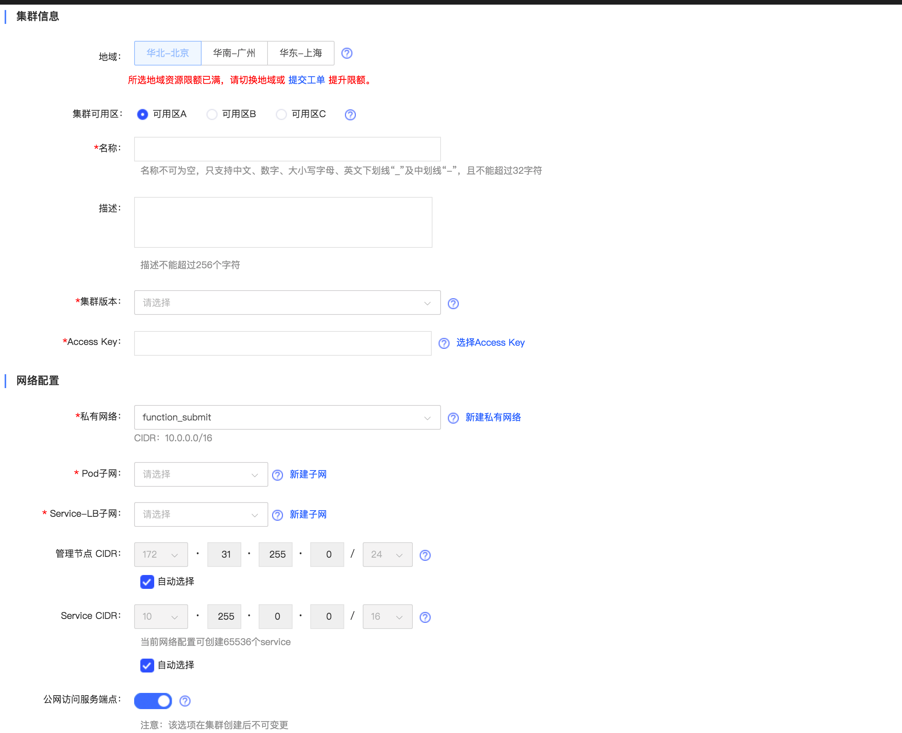

# 创建 Serverless集群

## 确认地域及实例配置
**确定实例所在地域**

京东云不同地域之间完全隔离，保证不同地域间最大程度的稳定性和容错性。当前覆盖国内华北-北京、华南-广州、华东-宿迁及华东-上海四地域。

目前Serverless集群在华北-北京、华南-广州、华东-上海开放服务，未来我们将逐步增加更多服务地域以满足您业务需求。

选择地域时建议考虑以下几点：

 - 集群与其他京东云产品间的部署关系；
 - 不同地域之间的云产品默认不能通过内网通信；
 - 集群默认不可跨地域内网互访，默认不可跨地域访问云数据库及云缓存等；
 - 在集群中创建云硬盘类型的持久化存储时，仅支持绑定同可用区下的云硬盘；      
 - 上述内网互通是均指同一账户下的资源互通，不同账户的资源内网完全隔离。

## 创建集群

 1. 打开控制台，选择[弹性计算>>Serverless 容器服务>>Serverless集群>>集群]( https://cns-console.jdcloud.com/host/cluster/servless/list)   
 
 2. 选择地域及可用区：建议您根据业务情况选择集群所在地域及可用区；默认选中指定地域下的所有可用区，推荐使用默认模式；也可取消选中某个或某几个可用区，但需要至少保证有一个可用区被选中。

 3. 设置名称、描述：名称不可为空，只支持中文、数字、大小写字母、英文下划线 “ _ ”及中划线 “ - ”，且不能超过32字符；描述为非必填项，长度不超过256字符。

 4. 集群版本：目前支持1.18版本。

 5. 添加Accesskey：选择启动状态下的Accesskey；如果无可用Access Key，请前往Access Key管理页面创建新的Access Key，并在开启状态。可参考[Accesskey管理](https://docs.jdcloud.com/cn/account-management/accesskey-management)。

## 网络配置

网络配置指选择部署工作节点组资源的私有网络：
  * 私有网络，用来创建Kubernetes集群的私有网络
  * 创建 Pod子网，创建的pod获得的ip会在此子网范围内
  * Service-LB子网，使用LoadBalancer类型的service时创建的实例会在此子网范围内
  * 管理节点CIDR，默认自动选择，系统会自动创建一个管理节点子网，建立VPC对等连接。
  * ServiceCIDR，默认自动选择，Cluster IP地址会创建在此范围内
  * 公网访问服务端点，默认开启，开启后kube-apiserver可以通过公网访问，关闭后不能通过公网访问。
  
创建集群时会对私有网络的相关配额进行校验，请保证私有网络相关配额充足，详情参考[私有网络使用限制](https://docs.jdcloud.com/cn/virtual-private-cloud/restrictions)。
