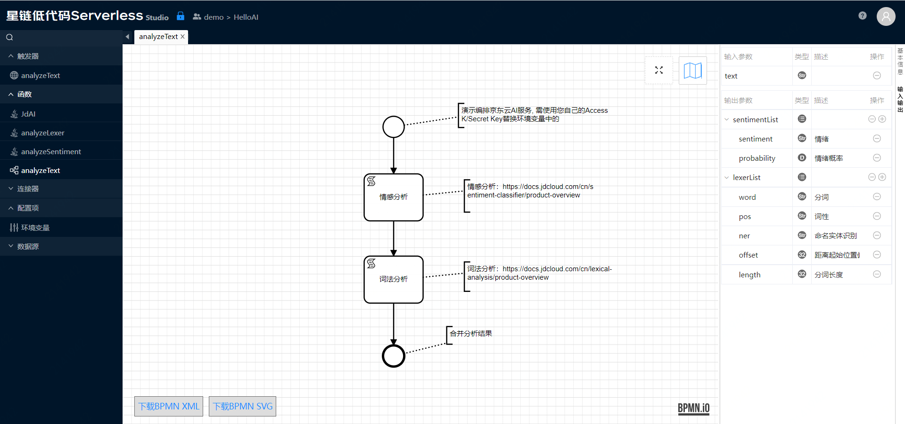
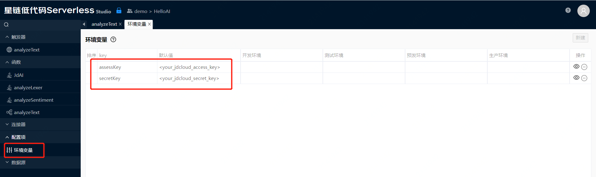
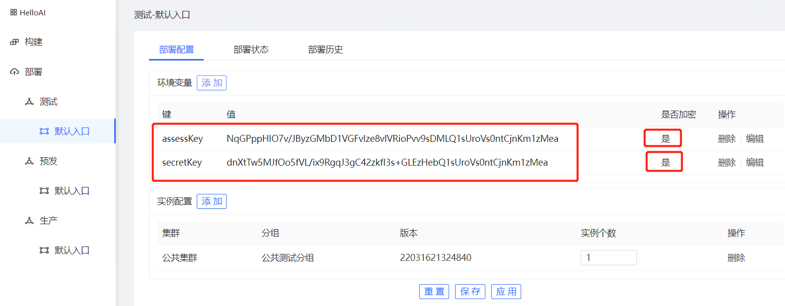
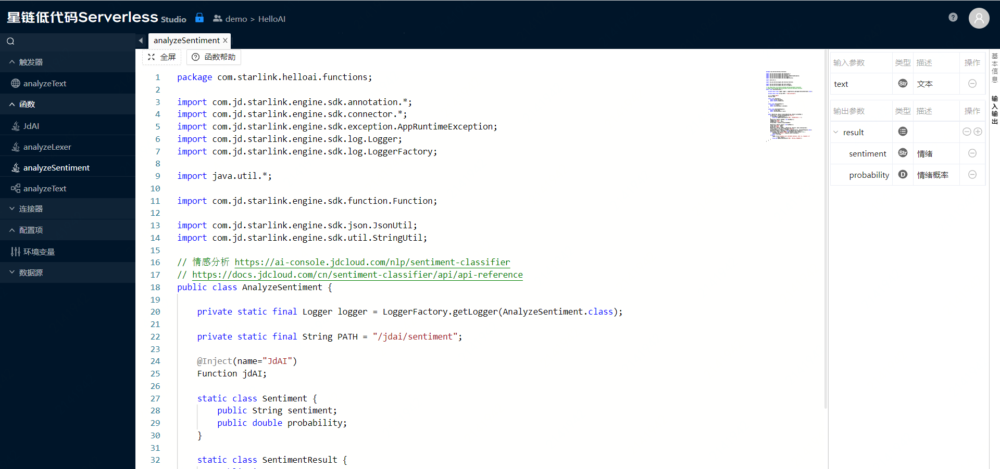
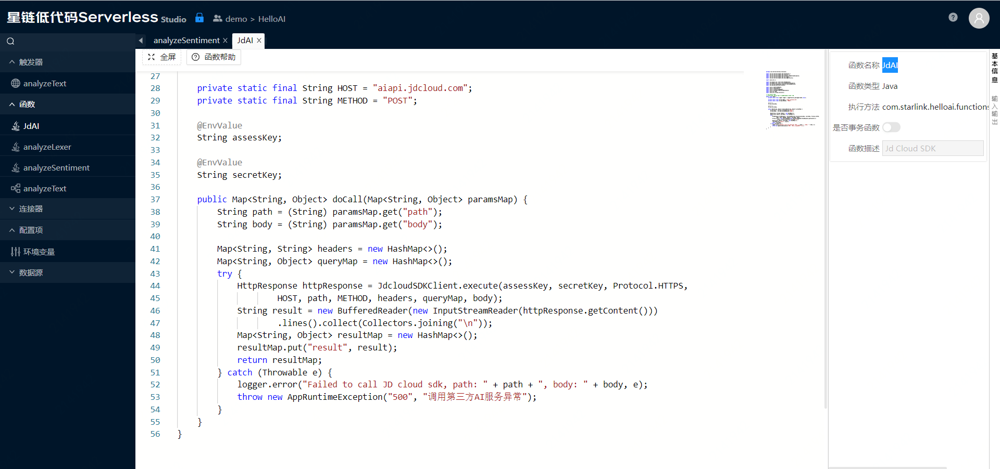
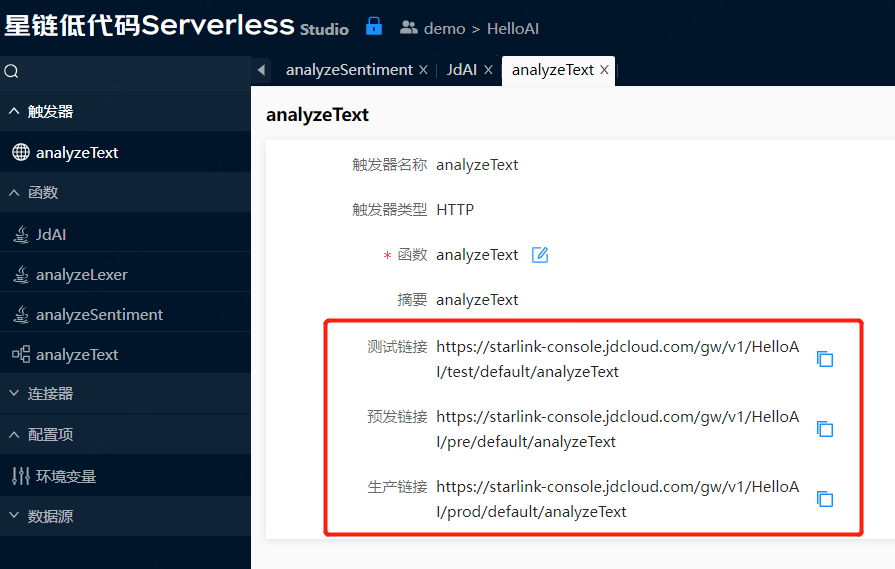
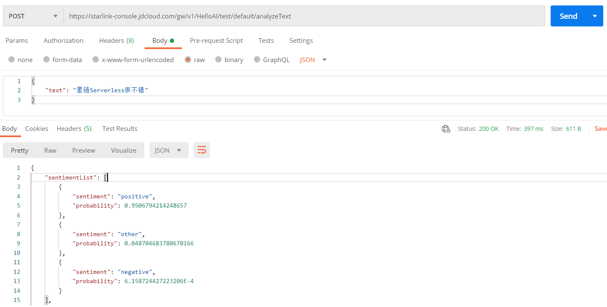

# AI服务示例

示例位于demo团队，可以直接打开只读版本：[Hello AI](https://starlink-console.jdcloud.com/studio/v2/index.html#/?vms=eyJ2bXNLZXkiOiJmMDliOWZlMDY5Nzc0MTQxYTM3ZDJjMjY5NTg1MDAwMiIsInZtc05hbWUiOiJIZWxsb0FJIiwiZ2l0VXJsIjoiaHR0cHM6Ly9jb2RlLmpkY2xvdWQuY29tL3N0YXJsaW5rLXZtcy9oZWxsb2FpLmdpdCIsInNjcmlwdFR5cGUiOiJKYXZhIiwidGVhbUtleSI6IjMwMWIzMWMyNWRmMjRjNDZiMjY3YzBkZTM4MzMwZTZhIiwiZ3JvdXBJZCI6ImNvbS5zdGFybGluayIsImF1dGhDb2RlIjowLCJ0ZWFtTmFtZSI6ImRlbW8ifQ)

> 示例VMS可以查看，但不可以修改/部署，您可以克隆至您自己的团队内修改。

该示例演示了使用京东云人工智能自然语言处理API。入口函数analyzeText是BPMN函数，它提供了组合的文本分析服务，如下图所示：

使用京东云人工智能服务需要提供AK(Access Key)和SK(Secret Key)，它们配置为了环境变量，如下图所示：

类似AK/SK这种比较敏感的数据，不建议在代码中直接提供，可以在部署时提供，部署时可以选择加密存储，如下图所示：

函数analyzeText调用了情感分析函数analyzeSentiment和词法分析函数analyzeLexer并汇总了它们的结果。 analyzeSentiment和analyzeLexer是两个Java函数，analyzeSentiment如下图所示：

它调用了另一个Java函数JdAI，如下图所示：

触发器定义如下图所示：
 

针对三个环境（测试、预发、生产），分别展示了对应的访问地址，在部署到对应的环境后可以访问。

访问方式目前只支持POST，请求响应格式为JSON。

使用Postman访问的截图如下所示：

    