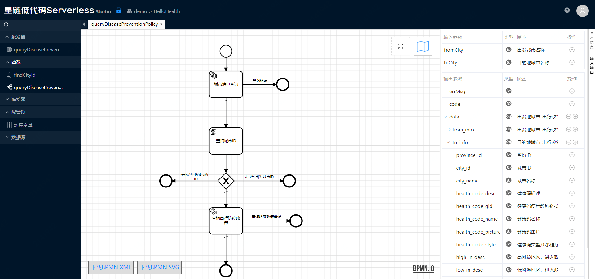
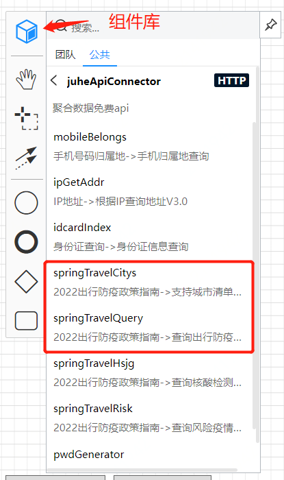
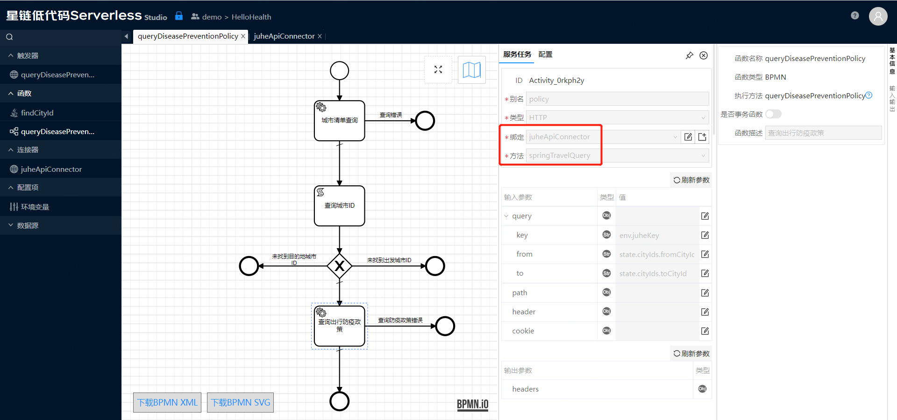
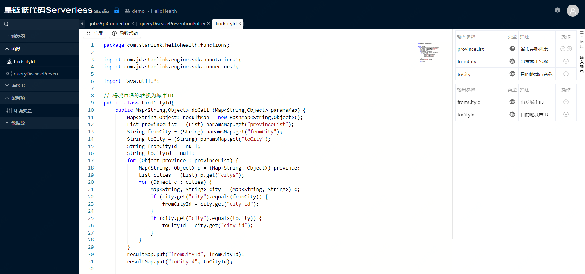
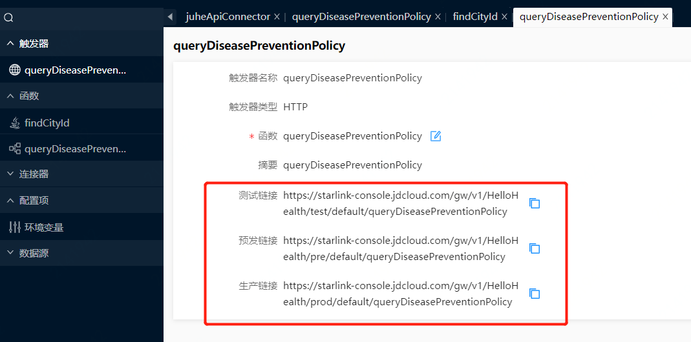

# 出行防疫政策API示例

示例位于demo团队，可以直接打开只读版本：[Hello Health](https://starlink-console.jdcloud.com/studio/v2/index.html#/?vms=eyJ2bXNLZXkiOiIxNjc3MWUyOTRjYWM0NjA5ODQyYzFhN2M4OWM3YmVmMSIsInZtc05hbWUiOiJIZWxsb0hlYWx0aCIsImdpdFVybCI6Imh0dHBzOi8vY29kZS5qZGNsb3VkLmNvbS9zdGFybGluay12bXMvaGVsbG9oZWFsdGguZ2l0Iiwic2NyaXB0VHlwZSI6IkphdmEiLCJ0ZWFtS2V5IjoiMzAxYjMxYzI1ZGYyNGM0NmIyNjdjMGRlMzgzMzBlNmEiLCJncm91cElkIjoiY29tLnN0YXJsaW5rIiwiYXV0aENvZGUiOjAsInRlYW1OYW1lIjoiZGVtbyJ9)

> 示例VMS可以查看，但不可以修改/部署，您可以克隆至您自己的团队内修改。

该示例演示了使用公共组件编排构建新的API。入口函数queryDiseasePreventionPolicy是一个BPMN函数，它的输入是出发和目的地城市名称，输出为出发和目的地城市的防疫政策，如下图所示：

支持的城市清单和具体的防疫政策调用的是公共组件中的连接器方法，公共组件如下图所示：

BPMN函数中对它们的引用如下图所示：

公共组件中需要的城市参数为ID，用户并不知道每个城市的ID是什么，所以，新API对外提供服务时，城市参数为名称，为了转换名称为ID，中间加入了一个代码函数findCityId，用于将名称转成为ID，如下图所示：

触发器定义如下图所示：
 

针对三个环境（测试、预发、生产），分别展示了对应的访问地址，在部署到对应的环境后可以访问。

访问方式目前只支持POST，请求响应格式为JSON。

使用Postman访问的截图如下所示：

    
