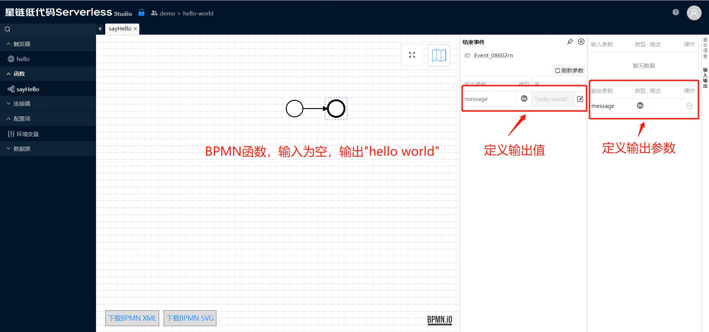
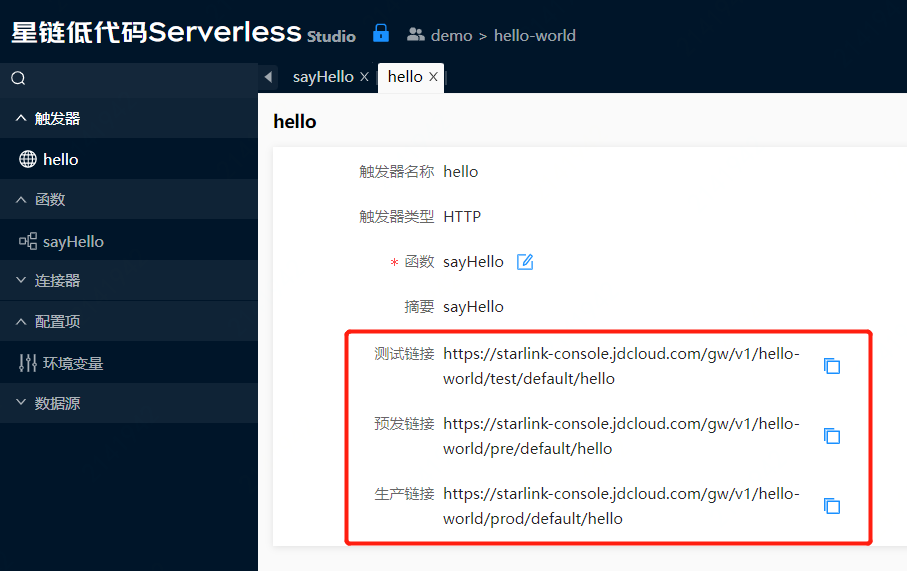
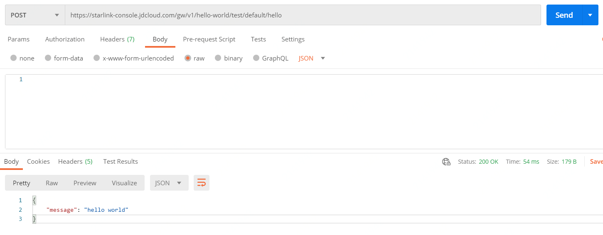

# Hello World

示例位于demo团队，可以直接打开只读版本：[Hello World](https://starlink-console.jdcloud.com/studio/v2/index.html#/?vms=eyJ2bXNLZXkiOiIwM2QxMzI0ZTUyZGU0NDRlOGU3MTliNzA2OTQ0YjNhMyIsInZtc05hbWUiOiJoZWxsby13b3JsZCIsImdpdFVybCI6Imh0dHBzOi8vY29kZS5qZGNsb3VkLmNvbS9zdGFybGluay12bXMvaGVsbG8td29ybGQuZ2l0Iiwic2NyaXB0VHlwZSI6IkphdmEiLCJ0ZWFtS2V5IjoiMzAxYjMxYzI1ZGYyNGM0NmIyNjdjMGRlMzgzMzBlNmEiLCJncm91cElkIjoiY29tLnN0YXJsaW5rLmhlbGxvIiwiYXV0aENvZGUiOjAsInRlYW1OYW1lIjoiZGVtbyJ9)

> 示例VMS可以查看，但不可以修改/部署，您可以克隆至您自己的团队内修改。

该示例非常简单，有一个BPMN函数和一个HTTP触发器。

函数定义如下图所示：

 触发器定义如下图所示：
  

 针对三个环境（测试、预发、生产），分别展示了对应的访问地址，在部署到对应的环境后可以访问。

 访问方式目前只支持POST，请求响应格式为JSON。

 使用Postman访问的截图如下所示：

