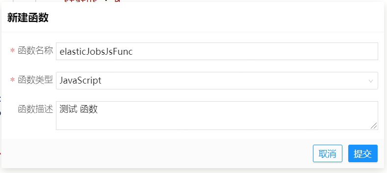

# JavaScript示例
 演示了JavaScript语言下各种触发器、连接器、函数的示例配置、用法和代码，示例代码可访问： [JavaScriptDemo](https://starlink-console.jdcloud.com/studio/v2/index.html#/?vms=eyJ2bXNLZXkiOiJiYzJiZWRiNGNkODM0OTZiOGI0MzllOTEzZjBlM2Y5NyIsInZtc05hbWUiOiJKYXZhU2NyaXB0RGVtbyIsImdpdFVybCI6Imh0dHBzOi8vY29kZS5qZGNsb3VkLmNvbS9zdGFybGluay12bXMvamF2YXNjcmlwdGRlbW8uZ2l0Iiwic2NyaXB0VHlwZSI6IkphdmFTY3JpcHQiLCJ0ZWFtS2V5IjoiMzAxYjMxYzI1ZGYyNGM0NmIyNjdjMGRlMzgzMzBlNmEiLCJncm91cElkIjoiY29tLmpkLmRlbW8iLCJhdXRoQ29kZSI6MCwidGVhbU5hbWUiOiJkZW1vIn0)。

> 示例VMS可以查看，但不可以修改/部署，您可以克隆至您自己的团队内修改。
 
## Connector 连接器配置
### Http Connector 连接器配置
**配置：**
#### 新建连接器
输入 **连接器名称** 和选择 **连接器类型** 为HTTP

#### 基础配置
- 1、点击连接器基础信息
- 2、配置连接器基础信息 **摘要** 和 **描述**
- 3、配置连接器配置信息 **根URL(支持环境变量配置)** **连接超时时间** **读写超时时间** **最大并发请求数**
  
#### 新增http连接器方法
- 1、支持 **get**、**post**、**put**、**delete** 请求类型
- 2、输入 **名称** **路径** **类型**
  
#### 配置http方法信息
- 1、配置基础信息
  
- 2、配置方法定义
    - 1、配置 **URL查询参数**
      URL 查询参数 即 url 后以 **&** 符号拼接参数 例如 id=1&name=zhangsan
      
    - 2、配置 **URL路径参数**
      URL 路径参数 即 以 {name} 在路径定义的参数
      
    - 3、配置 **请求头参数**
      请求头参数 即 http 请求需要的 请求头数据
      
    - 4、配置 **Cookie参数**
      Cookie 多个参数以 ; 拼接, 拼接参数 以 Cookie 放入请求头
      
    - 5、配置 **请求体**
      配置请求体数据 请求类型 支持 **json、text、x-www-form-urlencoded**
      
    - 6、请求参数和示例值互转
      为方便请求参数配置，支持参数定义与示例值互转，示例值有固定的结构，query表示url请求参数，path表示url请求路径参数，header表示请求头参数，body表示请求体参数，cookie表示cookie 参数。
      
- 3、配置响应参数
    - 1、配置响应体
      选择响应体根类型
      
    - 2、配置响应头
      配置响应头参数
      
    - 3、响应参数和示例值互转
      为方便参数定义，支持示例值转定义参数
      
### 数据源配置
**配置：**
#### 新建数据源
目前只支持 **mysql** 类型数据源

#### 配置数据源
**jdbcUrl 用户名 密码** 支持环境变量配置， 其他参数有默认值，可以根据实际需求进行调整

### DB 连接器配置
**配置：**
#### 新建连接器
输入 **连接器名称** 和选择 **连接器类型** 为DB

#### 基础配置
- 1、点击连接器基础信息
- 2、配置连接器基础信息 **摘要** 和 **描述**
- 3、配置连接器配置信息 **数据源(选择数据源绑定)**
  
#### 新增DB连接器方法
- 1、支持 **select**、**update**、**delete**、**insert** 类型
- 2、输入 **名称** **类型**
  
#### 配置DB方法信息
- 1、配置基础信息
  
- 2、配置方法定义
    - 1、**MyBatis Mapper语句**
      MyBatis Mapper语句 依据mybatis sql 语法， 不支持返回类型为自定义对象
      
    - 2、配置 **请求参数和响应参数**
      请求参数点击 添加参数 对应 mapper 语句的变量， 选择返回参数类型
      
    - 3、请求参数和示例值互转
      方便参数定义，支持示例值转定义参数
      
    - 4、响应参数和示例值互转
      方便参数定义，当返回是object 或者 list 类型支持相应参数与响应示例值互转
      
## Function 函数配置
### JavaScript 函数配置
**配置：**
#### 新建JavaScript类型函数
填入 函数名称(不可与其他函数重名) 选择 函数类型 JavaScript

#### 编辑开发JavaScript类型函数
创建函数之后就可以在该函数中写我们的业务逻辑了，面板分三块， 入参 出参 工作区 （如有入参和出参请一定定义参数）

#### 常用api示例用法
```JavaScript
/**
 * 处理具体逻辑的 js 类型 函数 示例 （常用工具及代码示例）
 */
function doCall(args) {
    //使用引擎内置对象runtime进行调用,rpc方法入参为HTTP Connector名称，execute方法入参为HTTP方法名、方法入参
    // 调用HTTP连接器 可以设置 query,path, header, cookie,body  等参数  注意 map 的 key 必须以这几个为key
    var httpReq = [
                    {
                        'query':{'dtype':'json','key':'08e92ae4949756ba4fdef17f2a78b29f'}
                    }
                  ]
    // juheGoodBook 是要调用的http 连接器名称  catalog 要调用连接器里的方法  httpReq 入参              
    let resultHttp = runtime.rpc('juheGoodBook').execute('catalog',httpReq)
    // 获取响应头
    var resHeader = resultHttp.headers
    // 获取响应体
    var resBody = resultHttp.body
    console.log("调用 http juheGoodBook catalog 返回 响应头 信息：", JSON.stringify(resHeader))
    console.log("调用 http juheGoodBook catalog 返回 响应体 信息：", JSON.stringify(resBody))


    //使用引擎内置对象runtime进行调用,db 方法入参为db Connector名称，execute方法入参为db方法名、方法入参
    let resultDb1 = runtime.db('mysqlConnector').execute('selectCount',[])
    console.log("调用 db mysqlConnector selectCount 返回 信息：", resultDb1)
    var dbReq = [
                    {
                        'pin':'zhangshanpin1',
                        'realName':"zhangsan1",
                        'status':'0',
                        'idType':'0',
                        'idNo':'011111',
                        'mobile':'18500000001'
                    }
                  ]

    let resultDb2 = runtime.db('mysqlConnector').execute('addUser',dbReq)
    console.log("调用 db mysqlConnector addUser 返回 信息：", resultDb2)
    
    // 调用其他函数示例
    var funcReq = [
                    {
                        'param1':'1111',
                        'param2':"2222"
                    }
                  ]
    // elasticJobJsFunc 被调用函数名称  funcReq 被调用函数入参
    let funcResult = runtime.function('elasticJobJsFunc').execute(funcReq)
    console.log("调用 function elasticJobJsFunc 返回 信息", JSON.stringify(funcResult))
    
    return {'resultCode':"ok"}
}

export {doCall}
```
### bpmn 函数配置
**配置：**
#### 新建bpmn类型函数
点击新增函数，填入 **函数名称** 选择 **函数类型** BPMN

#### 配置bpmn函数
- 1、编辑函数的入参和出参
  根据自己的业务编辑 bpmn 的入参和出参
  
- 2、拖入任务处理模块。任务分 服务任务 函数任务
  根据业务需求绑定自己需要的任务类型
  
  - 服务任务类型 （支持直接调用 连接器 HTTP DB）
    绑定 HTTP 连接器 并 绑定 连接器入参 （别名整个bpmn函数唯一）
    
    绑定 DB 连接器 并 绑定 连接器入参 （别名整个bpmn函数唯一）
    
  - 函数任务类型 （支持调用其他函数 包括 JavaScript类型函数 或者 bpmn 函数）
    绑定对应函数 并 绑定 函数入参 （别名整个bpmn函数唯一）
    
## Trigger 触发器配置
### kafka 触发器配置
#### 新建kafka消费者触发器
输入 触发器名称 选择 触发器类型 KAFKA 绑定 **函数**`（函数入参类型必须是 message -> Object, 函数可以是 JavaScript 函数 也可以是 bpmn 函数）`

#### 编辑kafka消费者触发器
填写 **摘要** **kafka接入点**(接入kafka集群地址，以逗号分隔，可以引用环境变量) **主题** **分组** **每次拉去最大条数** **最大阻塞时间(毫秒)** **消息类型** **验证模式** **自动提交** 等信息

### elastic job 触发器配置
**说明：**
不支持广播任务，只支持随机任务，即当同一服务部署多台时，任务调度只会调度其中一台执行
#### 新建elasticjob调度触发器
输入触发器名称 选择 触发器类型 ELASTIC_JOB 绑定 函数

#### 编辑elasticjob调度触发器
输入 cron表达式（例如： 0 0/1 * * * ? ） 输入 任务参数（任务参数即绑定的函数的入参 例如 {"param1":"aaa","param2":"bbb"}），任务参数只支持json

### http 触发器配置
**说明：**
目前只支持**POST**请求类型 请求数据格式只能是 **json**
#### 新建http API 触发器
输入 **触发器名称** 选择 **触发器类型** HTTP 绑定 **函数** 函数入参就是 请求体数据

#### 查看 http API 触发器
其中链接就是对外暴露的api地址 只支持 https  http会导致函数接收不到请求参数问题


