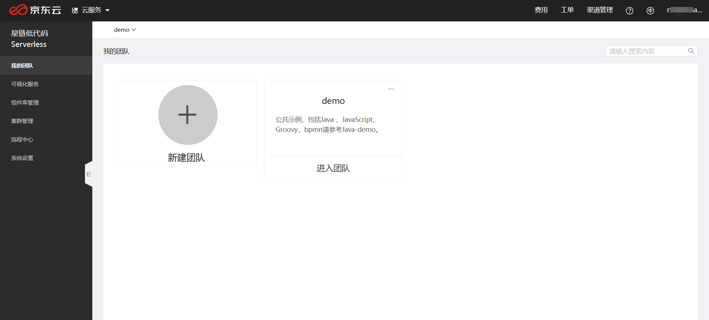
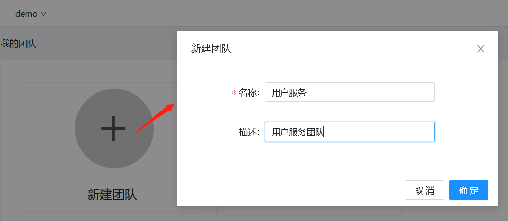
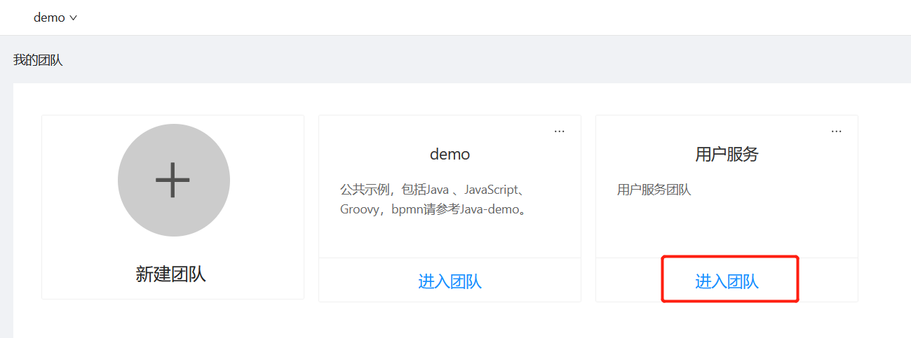

# 新建团队

用户登录星链默认即位于demo团队下，如下图所示：

demo团队中包含一些示例VMS，用户可以参考。但用户在demo团队中只是访客角色，不能新建VMS，新建VMS需要创建自己的团队，或者请已有团队的管理员把自己加入。

新建团队，如下图所示：

建好团队后，进入团队，如下图所示：

进入团队后，即可在该团队中[新建VMS](Create-VMS.md).

### 相关入门指南

- [新建VMS](Create-VMS.md)
- [开发VMS](Dev-VMS.md)
- [部署VMS](Deploy-VMS.md)