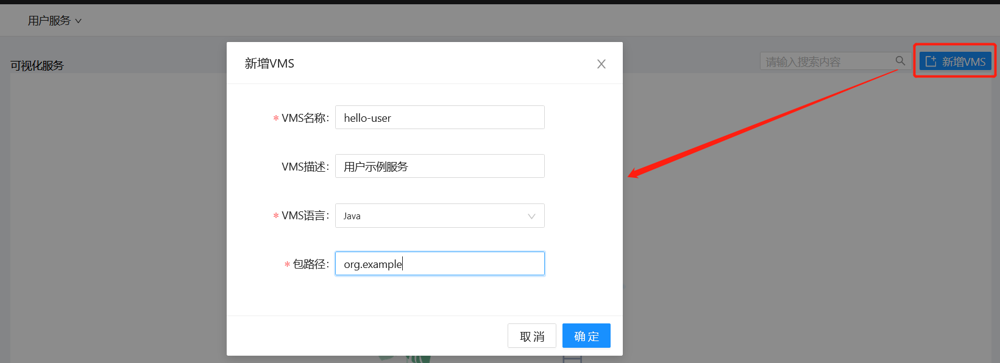
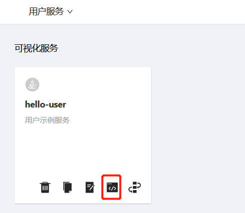

# 新建VMS

完成[新建团队](Create-VMS.md)后，点击新建VMS，如下图所示：

填写VMS信息的一些注意事项：
- VMS名称：目前需要是全局唯一的
- VMS语言：可以选择Java, JavaScript, Groovy，在一个VMS中只能使用一种语言
- 包路径：使用Java的语法，表示代码所在的目录层次结构

VMS创建后，在VMS卡片页点击开发VMS，如下图所示：

开始[开发VMS](Dev-VMS.md)。

### 相关入门指南

- [新建团队](Create-Team.md)
- [开发VMS](Dev-VMS.md)
- [部署VMS](Deploy-VMS.md)